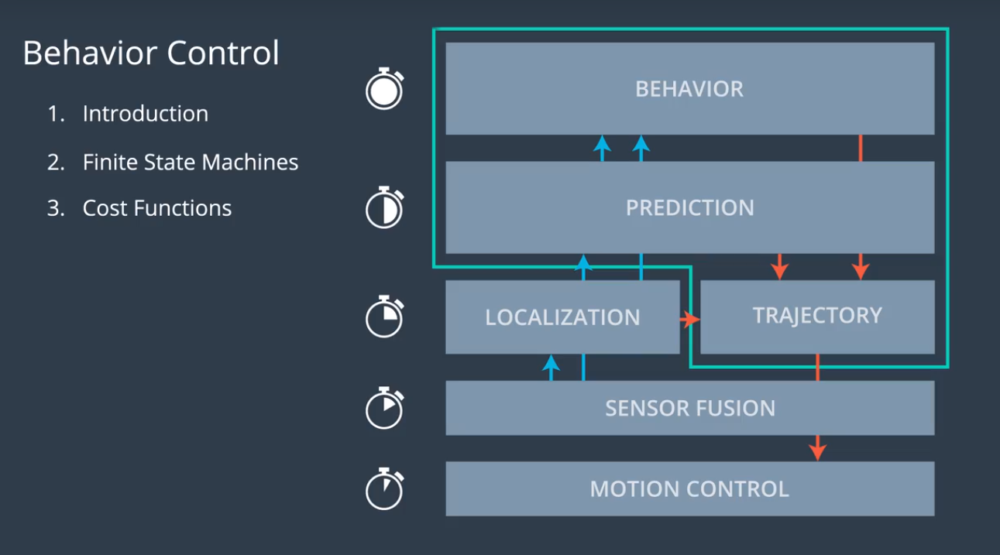
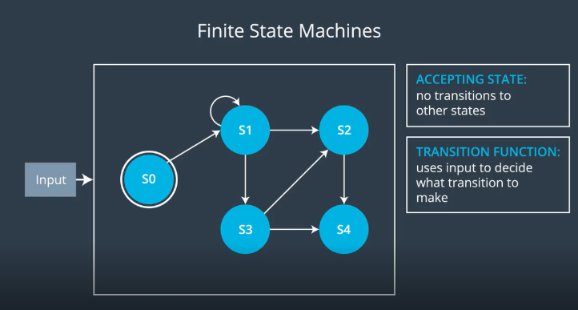
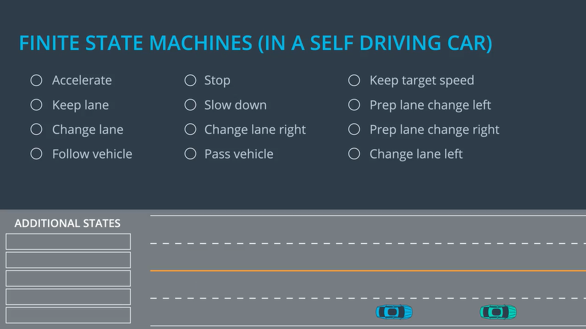
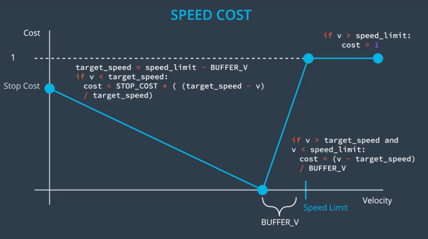
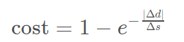
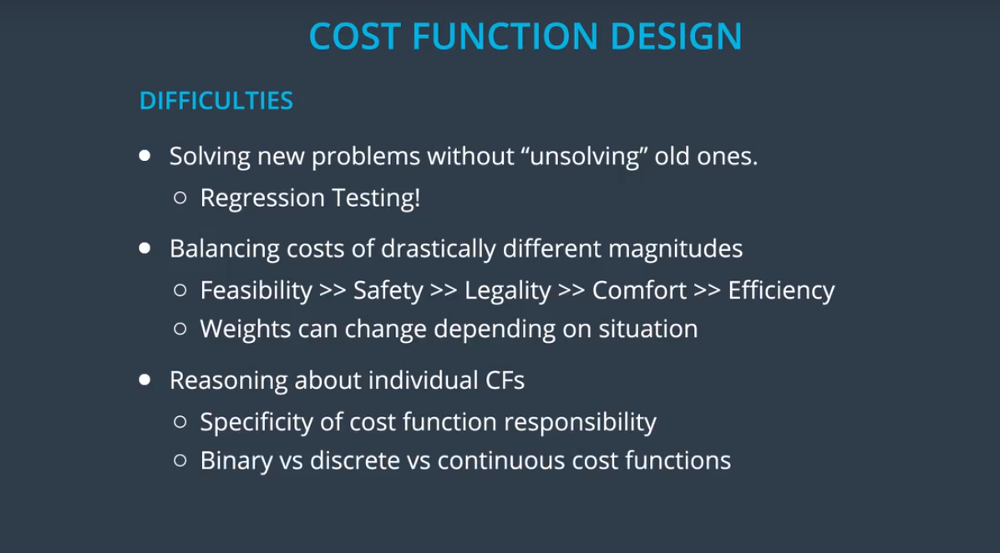
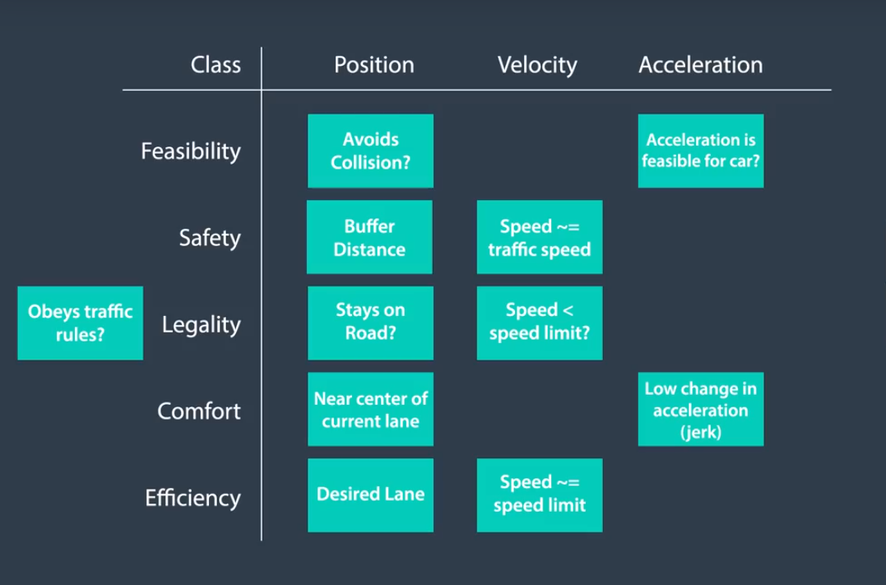
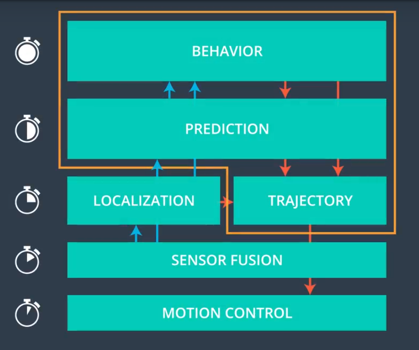
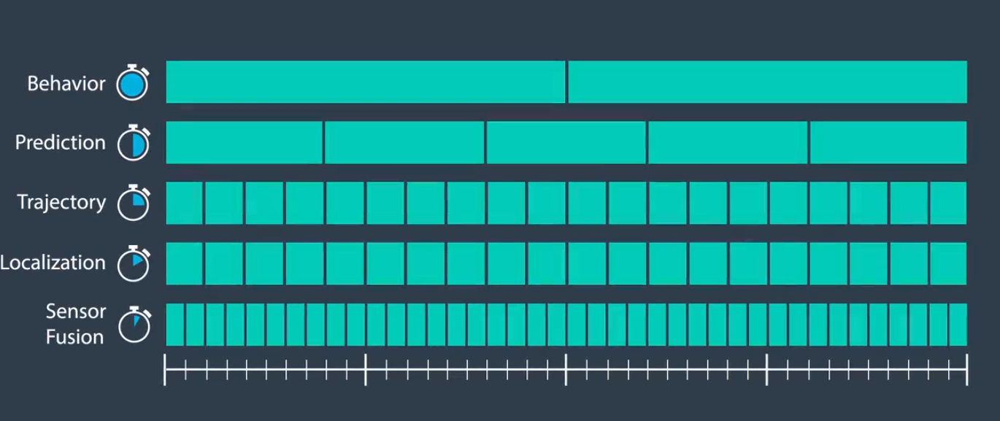

## Lesson outline



​    The behavior planning team is responsible for providing guidance to the trajectory planner about what sorts of maneuvers they should plan trajectories for. If you think about the over all flow of data in a self-driving car operating on the fastest time scales you have control. And with a slightly lower frequency than that you have Sensor Fusion. Just lower than that you have localization and trajectory planning which you learn more about in a next lesson. Next is Prediction which you just learned about.  And then at the top of this diagram is behavior planning with the lowest update rate. The inputs to behavior planning come from the prediction module and the localization module. Both of which get their inputs from the sensor fusion. And the output from the behavior module goes directly to the trajectory planner. Which also takes input from prediction and localization so that it can send trajectories to the motion controller.

## FSM



## States for Self Driving Cars



## Behavior Planning Pseudocode

One way to implement a transition function is by generating rough trajectories for each accessible "next state" and then finding the best. To "find the best" we generally use **cost functions**. We can then figure out how costly each rough trajectory is and then select the state with the lowest cost trajectory.

We'll discuss this in more detail later, but first read carefully through the pseudocode below to get a better sense for how a transition function might work.

```python
def transition_function(predictions, current_fsm_state, current_pose, cost_functions, weights):
    # only consider states which can be reached from current FSM state.
    possible_successor_states = successor_states(current_fsm_state)

    # keep track of the total cost of each state.
    costs = []
    for state in possible_successor_states:
        # generate a rough idea of what trajectory we would
        # follow IF we chose this state.
        trajectory_for_state = generate_trajectory(state, current_pose, predictions)

        # calculate the "cost" associated with that trajectory.
        cost_for_state = 0
        for i in range(len(cost_functions)) :
            # apply each cost function to the generated trajectory
            cost_function = cost_functions[i]
            cost_for_cost_function = cost_function(trajectory_for_state, predictions)

            # multiply the cost by the associated weight
            weight = weights[i]
            cost_for_state += weight * cost_for_cost_function
         costs.append({'state':state, 'cost':cost_for_state})

    # Find the minimum cost state.
    best_next_state = None
    min_cost = 9999999
    for i in range(len(possible_successor_states)):
        state = possible_successor_states[i]
        cost  = costs[i]
        if cost < min_cost:
            min_cost = cost
            best_next_state = state 

    return best_next_state
```

Obviously we are glossing over some important details here. Namely: what **are** these cost functions and how do we create them? We'll talk about that next!

## Create a Cost Function - Speed Penalty



 A key part of getting transitions to happen when we want them to is the design of reasonable cost functions.I want to penalize and reward the right things.I'm going to work through an example of one way you might think about designing a cost function.Let's consider how we would design a cost function for vehicle speed.On one hand, we want to get to our destination quickly,but on the other hand,we don't want to break the law.An essential quantity we have to control is the desired velocity of the car.Some velocities are more beneficial,some are even illegal.Let's fill in this graph and try to assign some costs to every velocity.For the sake of simplicity,let's assume that all of the cost functions will have an output between zero and one.We will adjust the importance of each cost function later by adjusting the weights.Let's say the speed limit for the road we are on is here.Well, we know that if we're going well above the speed limit,that should be maximum cost.And maybe we want to set an ideal zero cost speed that's slightly below the speed limit so that we have some buffer.And then we can think about how much we want to penalize not moving at all.Obviously, not moving is bad,but maybe not as bad as breaking the speed limit,so we would put it here.To keep it simple,we could just say there is a linear cost between zero and the target speed.And since breaking the law is a binary thing,let's just say any speed greater than or equal the speed limit has maximal cost.And again, we can arbitrarily connect these points with linear function and the flat maximum cost for anything above the speed limit.Now, in practice, we might actually want to parametrize some of these quantities so that we could later adjust them until we got the right behavior.So first, we might define a parameter called Stop Cost for the zero-velocity case and a parameter called buffer velocity which would probably be a few miles per hour.Then, our overall cost function has three domains.If we're going less than the target speed,the cost function would look like this.If we are above the speed limit,the cost is just one.And if we are between,the cost would look like this. Awesome.

## Implement a Cost Function in C++

In the previous quizzes, you designed a cost function to choose a lane when trying to reach a goal in highway driving:



Here, \Delta dΔ*d* was the lateral distance between the goal lane and the final chosen lane, and \Delta sΔ*s* was the longitudinal distance from the vehicle to the goal.

In this quiz, we'd like you to implement the cost function in C++, but with one important change. The finite state machine we use for vehicle behavior also includes states for planning a lane change right or left (PLCR or PLCL), and the cost function should incorporate this information. We will provide the following four inputs to the function:

- Intended lane: the intended lane for the given behavior. For PLCR, PLCL, LCR, and LCL, this would be the one lane over from the current lane.
- Final lane: the immediate resulting lane of the given behavior. For LCR and LCL, this would be one lane over.
- The Δ*s* distance to the goal.
- The goal lane.

Your task in the implementation will be to modify |\Delta d|∣Δ*d*∣ in the equation above so that it satisifes:

- ∣Δ*d*∣ is smaller as both intended lane and final lane are closer to the goal lane.
- The cost function provides different costs for each possible behavior: KL, PLCR/PLCL, LCR/LCL.
- The values produced by the cost function are in the range 0 to 1.

You can implement your solution in `cost.cpp` below.

#### code 

main.cpp

```C++
#include <iostream>
#include "cost.h"

using std::cout;
using std::endl;

int main() {
  int goal_lane = 0;
    
  // Test cases used for grading - do not change.
  double cost;
  cout << "Costs for (intended_lane, final_lane, goal_distance):" << endl;
  cout << "---------------------------------------------------------" << endl;
  cost = goal_distance_cost(goal_lane, 2, 2, 1.0);
  cout << "The cost is " << cost << " for " << "(2, 2, 1.0)" << endl;
  cost = goal_distance_cost(goal_lane, 2, 2, 10.0);
  cout << "The cost is " << cost << " for " << "(2, 2, 10.0)" << endl;
  cost = goal_distance_cost(goal_lane, 2, 2, 100.0);
  cout << "The cost is " << cost << " for " << "(2, 2, 100.0)" << endl;
  cost = goal_distance_cost(goal_lane, 1, 2, 100.0);
  cout << "The cost is " << cost << " for " << "(1, 2, 100.0)" << endl;
  cost = goal_distance_cost(goal_lane, 1, 1, 100.0);
  cout << "The cost is " << cost << " for " << "(1, 1, 100.0)" << endl;
  cost = goal_distance_cost(goal_lane, 0, 1, 100.0);
  cout << "The cost is " << cost << " for " << "(0, 1, 100.0)" << endl;
  cost = goal_distance_cost(goal_lane, 0, 0, 100.0);
  cout << "The cost is " << cost << " for " << "(0, 0, 100.0)" << endl;
    
  return 0;
}
```

cost.cpp

```C++
#include "cost.h"
#include <cmath>
using namespace std;

double goal_distance_cost(int goal_lane, int intended_lane, int final_lane, 
                          double distance_to_goal) {
  // The cost increases with both the distance of intended lane from the goal
  //   and the distance of the final lane from the goal. The cost of being out 
  //   of the goal lane also becomes larger as the vehicle approaches the goal.
    
  /**
   * TODO: Replace cost = 0 with an appropriate cost function.
   */
  double cost = 1 - exp(- (abs(intended_lane - goal_lane) + abs(final_lane - goal_lane)) / distance_to_goal);
    
  return cost;
}
```

cost.h

```C++
#ifndef COST_H
#define COST_H

double goal_distance_cost(int goal_lane, int intended_lane, int final_lane, 
                          double distance_to_goal);

#endif  // COST_H
```

Here is one possible solution for the previous quiz:

```python
double goal_distance_cost(int goal_lane, int intended_lane, int final_lane, 
                          double distance_to_goal) {
  // The cost increases with both the distance of intended lane from the goal
  //   and the distance of the final lane from the goal. The cost of being out 
  //   of the goal lane also becomes larger as the vehicle approaches the goal.
  int delta_d = 2.0 * goal_lane - intended_lane - final_lane;
  double cost = 1 - exp(-(std::abs(delta_d) / distance_to_goal));

  return cost;
}
```

##  Cost Function Design and Weight Tweaking





# Cost Function Matching

Consider the following cost functions. What purpose does each serve?

cost function1: Penalizes trajectories that attempt to accelerate at a rate which is not possible for the vehicle.

cost function2: Penalizes trajectories that drive off the road.

cost function3:  Penalizes trajectories that exceed the speed limit.

cost function4: Penalizes trajectories that do not stay near the center of the lane.

cost function5: Rewards trajectories that stay near the target lane.

# Scheduling Compute Time



In the very beginning of the lesson you have already seen this diagram.By now you might be able to guess why the Behavior Module updates on a lower frequency than for example the Trajectory Module.This is due to the fact that the high level decisions made in the behavior module spend a longer time horizon and just don't change as frequently. 



But the Trajectory Module does still count on our decisions and it's important that the over all system architecture doesn't allow for a comparatively slow module like the behavior planner to clock up the proper functioning of the other faster components. Let's take a second to talk about what's known as a scheduling problem and how it can be handled in the self-driving car.This diagram shows what happens during two processing cycles of the Behavior Module. As you can see, the Prediction Module updates with a higher frequency than Behavior. Trajectory is even higher. And so on.But focus your attention on what happens after behavior has completed its first cycle.To begin its second cycle,the behavior module needs data from prediction and localization.For localization, it's easy in theory since at this instant it will have some fresh data and behavior could just use that.But what about for prediction.It's actually right in the middle of an update cycle at this instant.Should behavior just wait until prediction is done?No. If we start waiting then we block up the pipeline for downstream components.The answer is to use data from here and accept that it's a little stale.When you implement your half planner for the final project,we will provide you with the code that handles all of this.But it's worth mentioning that this is how it's done.

## Implement Behavior Planner in C++

In this exercise you will implement a behavior planner and cost functions for highway driving. The planner will use prediction data to set the state of the ego vehicle to one of 5 values and generate a corresponding vehicle trajectory:

- `"KL"` - Keep Lane
- `"LCL"` / `"LCR"`- Lane Change Left / Lane Change Right
- `"PLCL"` / `"PLCR"` - Prepare Lane Change Left / Prepare Lane Change Right

The objective of the quiz is to navigate through traffic to the goal in as little time as possible. Note that the goal lane and s value, as well as the traffic speeds for each lane, are set in `main.cpp` below. Since the goal is in the slowest lane, in order to get the lowest time, you'll want to choose cost functions and weights to drive in faster lanes when appropriate. We've provided two suggested cost functions in `cost.cpp`.

### Instructions

1. Implement the `choose_next_state` method in the `vehicle.cpp` class.

   You can use the Behavior Planning Pseudocode concept

   as a guideline for your implementation. In this quiz, there are a couple of small differences from that pseudocode: you'll be returning a best trajectory corresponding to the best state instead of the state itself. Additionally, the function inputs will be slightly different in this quiz than in the classroom concept. For this part of the quiz, we have provided several useful functions:

   1. `successor_states()` - Uses the current state to return a vector of possible successor states for the finite state machine.
   2. `generate_trajectory()` - Returns a vector of Vehicle objects representing a vehicle trajectory, given a state and predictions. Note that trajectory vectors might have size 0 if no possible trajectory exists for the state.
   3. `calculate_cost()` - Included from cost.cpp, computes the cost for a trajectory.

2. **Choose appropriate weights for the cost functions in cost.cpp to induce the desired vehicle behavior.** Two suggested cost functions have been implemented based on previous quizzes, but you are free to experiment with your own cost functions. The `get_helper_data()` function in `cost.cpp` provides some preprocessing of vehicle data that may be useful in your cost functions. See if you can get the vehicle to move into a fast lane for a portion of the track and then move back to reach the goal!

3. Hit Test Run and see how your car does! How fast can you get to the goal?

#### Extra Practice

Provided in one of the links below is a zip file `python_3_practice`, which is the same problem written in Python 3 - you can optionally use this file for additional coding practice. In the `python_3_solution` link, the solution is provided as well. If you get stuck on the quiz see if you can convert the python solution to C++ and pass the classroom quiz with it. You can run the python quiz with `python simulate_behavior.py`.

### code

main.cpp

```C++
#include <iostream>
#include <vector>
#include "road.h"
#include "vehicle.h"

using std::cout;
using std::endl;

// impacts default behavior for most states
int SPEED_LIMIT = 10;

// all traffic in lane (besides ego) follow these speeds
vector<int> LANE_SPEEDS = {6,7,8,9}; 

// Number of available "cells" which should have traffic
double TRAFFIC_DENSITY = 0.15;

// At each timestep, ego can set acceleration to value between 
//   -MAX_ACCEL and MAX_ACCEL
int MAX_ACCEL = 2;

// s value and lane number of goal.
vector<int> GOAL = {300, 0};

// These affect the visualization
int FRAMES_PER_SECOND = 4;
int AMOUNT_OF_ROAD_VISIBLE = 40;

int main() {
  Road road = Road(SPEED_LIMIT, TRAFFIC_DENSITY, LANE_SPEEDS);

  road.update_width = AMOUNT_OF_ROAD_VISIBLE;

  road.populate_traffic();

  int goal_s = GOAL[0];
  int goal_lane = GOAL[1];

  // configuration data: speed limit, num_lanes, goal_s, goal_lane, 
  //   and max_acceleration
  int num_lanes = LANE_SPEEDS.size();
  vector<int> ego_config = {SPEED_LIMIT,num_lanes,goal_s,goal_lane,MAX_ACCEL};
   
  road.add_ego(2,0, ego_config);
  int timestep = 0;
  
  while (road.get_ego().s <= GOAL[0]) {
    ++timestep;
    if (timestep > 100) {
      break;
    }
    road.advance();
    road.display(timestep);
    //time.sleep(float(1.0) / FRAMES_PER_SECOND);
  }

  Vehicle ego = road.get_ego();
  if (ego.lane == GOAL[1]) {
    cout << "You got to the goal in " << timestep << " seconds!" << endl;
    if(timestep > 35) {
      cout << "But it took too long to reach the goal. Go faster!" << endl;
    }
  } else {
    cout << "You missed the goal. You are in lane " << ego.lane 
         << " instead of " << GOAL[1] << "." << endl;
  }

  return 0;
}
```

vehicle.cpp

```C++
#include <vector>
#include "cost.h"

using std::string;
using std::vector;

// Initializes Vehicle
Vehicle::Vehicle(){}

Vehicle::Vehicle(int lane, float s, float v, float a, string state) {
  this->lane = lane;
  this->s = s;
  this->v = v;
  this->a = a;
  this->state = state;
  max_acceleration = -1;
}

Vehicle::~Vehicle() {}

vector<Vehicle> Vehicle::choose_next_state(map<int, vector<Vehicle>> &predictions) {
  /**
   * Here you can implement the transition_function code from the Behavior 
   *   Planning Pseudocode classroom concept.
   *
   * @param A predictions map. This is a map of vehicle id keys with predicted
   *   vehicle trajectories as values. Trajectories are a vector of Vehicle 
   *   objects representing the vehicle at the current timestep and one timestep
   *   in the future.
   * @output The best (lowest cost) trajectory corresponding to the next ego 
   *   vehicle state.
   *
   * Functions that will be useful:
   * 1. successor_states - Uses the current state to return a vector of possible
   *    successor states for the finite state machine.
   * 2. generate_trajectory - Returns a vector of Vehicle objects representing 
   *    a vehicle trajectory, given a state and predictions. Note that 
   *    trajectory vectors might have size 0 if no possible trajectory exists 
   *    for the state. 
   * 3. calculate_cost - Included from cost.cpp, computes the cost for a trajectory.
   *
   * TODO: Your solution here.
   */
  vector<string> states = successor_states();
  float cost;
  vector<float> costs;
  vector<vector<Vehicle>> final_trajectories;

  for (vector<string>::iterator it = states.begin(); it != states.end(); ++it) {
    vector<Vehicle> trajectory = generate_trajectory(*it, predictions);
    if (trajectory.size() != 0) {
      cost = calculate_cost(*this, predictions, trajectory);
      costs.push_back(cost);
      final_trajectories.push_back(trajectory);
    }
  }

  vector<float>::iterator best_cost = min_element(begin(costs), end(costs));
  int best_idx = distance(begin(costs), best_cost);

  /**
   * TODO: Change return value here:
   */
  return final_trajectories[best_idx];
}

vector<string> Vehicle::successor_states() {
  // Provides the possible next states given the current state for the FSM 
  //   discussed in the course, with the exception that lane changes happen 
  //   instantaneously, so LCL and LCR can only transition back to KL.
  vector<string> states;
  states.push_back("KL");
  string state = this->state;
  if(state.compare("KL") == 0) {
    states.push_back("PLCL");
    states.push_back("PLCR");
  } else if (state.compare("PLCL") == 0) {
    if (lane != lanes_available - 1) {
      states.push_back("PLCL");
      states.push_back("LCL");
    }
  } else if (state.compare("PLCR") == 0) {
    if (lane != 0) {
      states.push_back("PLCR");
      states.push_back("LCR");
    }
  }
    
  // If state is "LCL" or "LCR", then just return "KL"
  return states;
}

vector<Vehicle> Vehicle::generate_trajectory(string state, 
                                             map<int, vector<Vehicle>> &predictions) {
  // Given a possible next state, generate the appropriate trajectory to realize
  //   the next state.
  vector<Vehicle> trajectory;
  if (state.compare("CS") == 0) {
    trajectory = constant_speed_trajectory();
  } else if (state.compare("KL") == 0) {
    trajectory = keep_lane_trajectory(predictions);
  } else if (state.compare("LCL") == 0 || state.compare("LCR") == 0) {
    trajectory = lane_change_trajectory(state, predictions);
  } else if (state.compare("PLCL") == 0 || state.compare("PLCR") == 0) {
    trajectory = prep_lane_change_trajectory(state, predictions);
  }

  return trajectory;
}

vector<float> Vehicle::get_kinematics(map<int, vector<Vehicle>> &predictions, 
                                      int lane) {
  // Gets next timestep kinematics (position, velocity, acceleration) 
  //   for a given lane. Tries to choose the maximum velocity and acceleration, 
  //   given other vehicle positions and accel/velocity constraints.
  float max_velocity_accel_limit = this->max_acceleration + this->v;
  float new_position;
  float new_velocity;
  float new_accel;
  Vehicle vehicle_ahead;
  Vehicle vehicle_behind;

  if (get_vehicle_ahead(predictions, lane, vehicle_ahead)) {
    if (get_vehicle_behind(predictions, lane, vehicle_behind)) {
      // must travel at the speed of traffic, regardless of preferred buffer
      new_velocity = vehicle_ahead.v;
    } else {
      float max_velocity_in_front = (vehicle_ahead.s - this->s 
                                  - this->preferred_buffer) + vehicle_ahead.v 
                                  - 0.5 * (this->a);
      new_velocity = std::min(std::min(max_velocity_in_front, 
                                       max_velocity_accel_limit), 
                                       this->target_speed);
    }
  } else {
    new_velocity = std::min(max_velocity_accel_limit, this->target_speed);
  }
    
  new_accel = new_velocity - this->v; // Equation: (v_1 - v_0)/t = acceleration
  new_position = this->s + new_velocity + new_accel / 2.0;
    
  return{new_position, new_velocity, new_accel};
}

vector<Vehicle> Vehicle::constant_speed_trajectory() {
  // Generate a constant speed trajectory.
  float next_pos = position_at(1);
  vector<Vehicle> trajectory = {Vehicle(this->lane,this->s,this->v,this->a,this->state), 
                                Vehicle(this->lane,next_pos,this->v,0,this->state)};
  return trajectory;
}

vector<Vehicle> Vehicle::keep_lane_trajectory(map<int, vector<Vehicle>> &predictions) {
  // Generate a keep lane trajectory.
  vector<Vehicle> trajectory = {Vehicle(lane, this->s, this->v, this->a, state)};
  vector<float> kinematics = get_kinematics(predictions, this->lane);
  float new_s = kinematics[0];
  float new_v = kinematics[1];
  float new_a = kinematics[2];
  trajectory.push_back(Vehicle(this->lane, new_s, new_v, new_a, "KL"));
  
  return trajectory;
}

vector<Vehicle> Vehicle::prep_lane_change_trajectory(string state, 
                                                     map<int, vector<Vehicle>> &predictions) {
  // Generate a trajectory preparing for a lane change.
  float new_s;
  float new_v;
  float new_a;
  Vehicle vehicle_behind;
  int new_lane = this->lane + lane_direction[state];
  vector<Vehicle> trajectory = {Vehicle(this->lane, this->s, this->v, this->a, 
                                        this->state)};
  vector<float> curr_lane_new_kinematics = get_kinematics(predictions, this->lane);

  if (get_vehicle_behind(predictions, this->lane, vehicle_behind)) {
    // Keep speed of current lane so as not to collide with car behind.
    new_s = curr_lane_new_kinematics[0];
    new_v = curr_lane_new_kinematics[1];
    new_a = curr_lane_new_kinematics[2];    
  } else {
    vector<float> best_kinematics;
    vector<float> next_lane_new_kinematics = get_kinematics(predictions, new_lane);
    // Choose kinematics with lowest velocity.
    if (next_lane_new_kinematics[1] < curr_lane_new_kinematics[1]) {
      best_kinematics = next_lane_new_kinematics;
    } else {
      best_kinematics = curr_lane_new_kinematics;
    }
    new_s = best_kinematics[0];
    new_v = best_kinematics[1];
    new_a = best_kinematics[2];
  }

  trajectory.push_back(Vehicle(this->lane, new_s, new_v, new_a, state));
  
  return trajectory;
}

vector<Vehicle> Vehicle::lane_change_trajectory(string state, 
                                                map<int, vector<Vehicle>> &predictions) {
  // Generate a lane change trajectory.
  int new_lane = this->lane + lane_direction[state];
  vector<Vehicle> trajectory;
  Vehicle next_lane_vehicle;
  // Check if a lane change is possible (check if another vehicle occupies 
  //   that spot).
  for (map<int, vector<Vehicle>>::iterator it = predictions.begin(); 
       it != predictions.end(); ++it) {
    next_lane_vehicle = it->second[0];
    if (next_lane_vehicle.s == this->s && next_lane_vehicle.lane == new_lane) {
      // If lane change is not possible, return empty trajectory.
      return trajectory;
    }
  }
  trajectory.push_back(Vehicle(this->lane, this->s, this->v, this->a, 
                               this->state));
  vector<float> kinematics = get_kinematics(predictions, new_lane);
  trajectory.push_back(Vehicle(new_lane, kinematics[0], kinematics[1], 
                               kinematics[2], state));
  return trajectory;
}

void Vehicle::increment(int dt = 1) {
  this->s = position_at(dt);
}

float Vehicle::position_at(int t) {
  return this->s + this->v*t + this->a*t*t/2.0;
}

bool Vehicle::get_vehicle_behind(map<int, vector<Vehicle>> &predictions, 
                                 int lane, Vehicle &rVehicle) {
  // Returns a true if a vehicle is found behind the current vehicle, false 
  //   otherwise. The passed reference rVehicle is updated if a vehicle is found.
  int max_s = -1;
  bool found_vehicle = false;
  Vehicle temp_vehicle;
  for (map<int, vector<Vehicle>>::iterator it = predictions.begin(); 
       it != predictions.end(); ++it) {
    temp_vehicle = it->second[0];
    if (temp_vehicle.lane == this->lane && temp_vehicle.s < this->s 
        && temp_vehicle.s > max_s) {
      max_s = temp_vehicle.s;
      rVehicle = temp_vehicle;
      found_vehicle = true;
    }
  }
  
  return found_vehicle;
}

bool Vehicle::get_vehicle_ahead(map<int, vector<Vehicle>> &predictions, 
                                int lane, Vehicle &rVehicle) {
  // Returns a true if a vehicle is found ahead of the current vehicle, false 
  //   otherwise. The passed reference rVehicle is updated if a vehicle is found.
  int min_s = this->goal_s;
  bool found_vehicle = false;
  Vehicle temp_vehicle;
  for (map<int, vector<Vehicle>>::iterator it = predictions.begin(); 
       it != predictions.end(); ++it) {
    temp_vehicle = it->second[0];
    if (temp_vehicle.lane == this->lane && temp_vehicle.s > this->s 
        && temp_vehicle.s < min_s) {
      min_s = temp_vehicle.s;
      rVehicle = temp_vehicle;
      found_vehicle = true;
    }
  }
  
  return found_vehicle;
}

vector<Vehicle> Vehicle::generate_predictions(int horizon) {
  // Generates predictions for non-ego vehicles to be used in trajectory 
  //   generation for the ego vehicle.
  vector<Vehicle> predictions;
  for(int i = 0; i < horizon; ++i) {
    float next_s = position_at(i);
    float next_v = 0;
    if (i < horizon-1) {
      next_v = position_at(i+1) - s;
    }
    predictions.push_back(Vehicle(this->lane, next_s, next_v, 0));
  }
  
  return predictions;
}

void Vehicle::realize_next_state(vector<Vehicle> &trajectory) {
  // Sets state and kinematics for ego vehicle using the last state of the trajectory.
  Vehicle next_state = trajectory[1];
  this->state = next_state.state;
  this->lane = next_state.lane;
  this->s = next_state.s;
  this->v = next_state.v;
  this->a = next_state.a;
}

void Vehicle::configure(vector<int> &road_data) {
  // Called by simulator before simulation begins. Sets various parameters which
  //   will impact the ego vehicle.
  target_speed = road_data[0];
  lanes_available = road_data[1];
  goal_s = road_data[2];
  goal_lane = road_data[3];
  max_acceleration = road_data[4];
}
```

vehicle.h

```C++
#ifndef VEHICLE_H
#define VEHICLE_H

#include <map>
#include <string>
#include <vector>

using std::map;
using std::string;
using std::vector;

class Vehicle {
 public:
  // Constructors
  Vehicle();
  Vehicle(int lane, float s, float v, float a, string state="CS");

  // Destructor
  virtual ~Vehicle();

  // Vehicle functions
  vector<Vehicle> choose_next_state(map<int, vector<Vehicle>> &predictions);

  vector<string> successor_states();

  vector<Vehicle> generate_trajectory(string state, 
                                      map<int, vector<Vehicle>> &predictions);

  vector<float> get_kinematics(map<int, vector<Vehicle>> &predictions, int lane);

  vector<Vehicle> constant_speed_trajectory();

  vector<Vehicle> keep_lane_trajectory(map<int, vector<Vehicle>> &predictions);

  vector<Vehicle> lane_change_trajectory(string state, 
                                         map<int, vector<Vehicle>> &predictions);

  vector<Vehicle> prep_lane_change_trajectory(string state, 
                                              map<int, vector<Vehicle>> &predictions);

  void increment(int dt);

  float position_at(int t);

  bool get_vehicle_behind(map<int, vector<Vehicle>> &predictions, int lane, 
                          Vehicle &rVehicle);

  bool get_vehicle_ahead(map<int, vector<Vehicle>> &predictions, int lane, 
                         Vehicle &rVehicle);

  vector<Vehicle> generate_predictions(int horizon=2);

  void realize_next_state(vector<Vehicle> &trajectory);

  void configure(vector<int> &road_data);

  // public Vehicle variables
  struct collider{
    bool collision; // is there a collision?
    int  time; // time collision happens
  };

  map<string, int> lane_direction = {{"PLCL", 1}, {"LCL", 1}, 
                                     {"LCR", -1}, {"PLCR", -1}};

  int L = 1;

  int preferred_buffer = 6; // impacts "keep lane" behavior.

  int lane, s, goal_lane, goal_s, lanes_available;

  float v, target_speed, a, max_acceleration;

  string state;
};

#endif  // VEHICLE_H
```

cost.cpp

```C++
#include "cost.h"
#include <cmath>
#include <functional>
#include <iterator>
#include <map>
#include <string>
#include <vector>
#include "vehicle.h"

using std::string;
using std::vector;

/**
 * TODO: change weights for cost functions.
 */
const float REACH_GOAL = pow(10, 6);
const float EFFICIENCY = pow(10, 5);

// Here we have provided two possible suggestions for cost functions, but feel 
//   free to use your own! The weighted cost over all cost functions is computed
//   in calculate_cost. The data from get_helper_data will be very useful in 
//   your implementation of the cost functions below. Please see get_helper_data
//   for details on how the helper data is computed.

float goal_distance_cost(const Vehicle &vehicle, 
                         const vector<Vehicle> &trajectory, 
                         const map<int, vector<Vehicle>> &predictions, 
                         map<string, float> &data) {
  // Cost increases based on distance of intended lane (for planning a lane 
  //   change) and final lane of trajectory.
  // Cost of being out of goal lane also becomes larger as vehicle approaches 
  //   goal distance.
  // This function is very similar to what you have already implemented in the 
  //   "Implement a Cost Function in C++" quiz.
  float cost;
  float distance = data["distance_to_goal"];
  if (distance > 0) {
    cost = 1 - 2*exp(-(abs(2.0*vehicle.goal_lane - data["intended_lane"] 
         - data["final_lane"]) / distance));
  } else {
    cost = 1;
  }

  return cost;
}

float inefficiency_cost(const Vehicle &vehicle, 
                        const vector<Vehicle> &trajectory, 
                        const map<int, vector<Vehicle>> &predictions, 
                        map<string, float> &data) {
  // Cost becomes higher for trajectories with intended lane and final lane 
  //   that have traffic slower than vehicle's target speed.
  // You can use the lane_speed function to determine the speed for a lane. 
  // This function is very similar to what you have already implemented in 
  //   the "Implement a Second Cost Function in C++" quiz.
  float proposed_speed_intended = lane_speed(predictions, data["intended_lane"]);
  if (proposed_speed_intended < 0) {
    proposed_speed_intended = vehicle.target_speed;
  }

  float proposed_speed_final = lane_speed(predictions, data["final_lane"]);
  if (proposed_speed_final < 0) {
    proposed_speed_final = vehicle.target_speed;
  }
    
  float cost = (2.0*vehicle.target_speed - proposed_speed_intended 
             - proposed_speed_final)/vehicle.target_speed;

  return cost;
}

float lane_speed(const map<int, vector<Vehicle>> &predictions, int lane) {
  // All non ego vehicles in a lane have the same speed, so to get the speed 
  //   limit for a lane, we can just find one vehicle in that lane.
  for (map<int, vector<Vehicle>>::const_iterator it = predictions.begin(); 
       it != predictions.end(); ++it) {
    int key = it->first;
    Vehicle vehicle = it->second[0];
    if (vehicle.lane == lane && key != -1) {
      return vehicle.v;
    }
  }
  // Found no vehicle in the lane
  return -1.0;
}

float calculate_cost(const Vehicle &vehicle, 
                     const map<int, vector<Vehicle>> &predictions, 
                     const vector<Vehicle> &trajectory) {
  // Sum weighted cost functions to get total cost for trajectory.
  map<string, float> trajectory_data = get_helper_data(vehicle, trajectory, 
                                                       predictions);
  float cost = 0.0;

  // Add additional cost functions here.
  vector<std::function<float(const Vehicle &, const vector<Vehicle> &, 
                             const map<int, vector<Vehicle>> &, 
                             map<string, float> &)
    >> cf_list = {goal_distance_cost, inefficiency_cost};
  vector<float> weight_list = {REACH_GOAL, EFFICIENCY};
    
  for (int i = 0; i < cf_list.size(); ++i) {
    float new_cost = weight_list[i]*cf_list[i](vehicle, trajectory, predictions, 
                                               trajectory_data);
    cost += new_cost;
  }

  return cost;
}

map<string, float> get_helper_data(const Vehicle &vehicle, 
                                   const vector<Vehicle> &trajectory, 
                                   const map<int, vector<Vehicle>> &predictions) {
  // Generate helper data to use in cost functions:
  // intended_lane: the current lane +/- 1 if vehicle is planning or 
  //   executing a lane change.
  // final_lane: the lane of the vehicle at the end of the trajectory.
  // distance_to_goal: the distance of the vehicle to the goal.

  // Note that intended_lane and final_lane are both included to help 
  //   differentiate between planning and executing a lane change in the 
  //   cost functions.
  map<string, float> trajectory_data;
  Vehicle trajectory_last = trajectory[1];
  float intended_lane;

  if (trajectory_last.state.compare("PLCL") == 0) {
    intended_lane = trajectory_last.lane + 1;
  } else if (trajectory_last.state.compare("PLCR") == 0) {
    intended_lane = trajectory_last.lane - 1;
  } else {
    intended_lane = trajectory_last.lane;
  }

  float distance_to_goal = vehicle.goal_s - trajectory_last.s;
  float final_lane = trajectory_last.lane;
  trajectory_data["intended_lane"] = intended_lane;
  trajectory_data["final_lane"] = final_lane;
  trajectory_data["distance_to_goal"] = distance_to_goal;
    
  return trajectory_data;
}
```

cost.h

```C++
#ifndef COST_H
#define COST_H

#include "vehicle.h"

using std::map;
using std::string;
using std::vector;

float calculate_cost(const Vehicle &vehicle, 
                     const map<int, vector<Vehicle>> &predictions, 
                     const vector<Vehicle> &trajectory);

float goal_distance_cost(const Vehicle &vehicle,  
                         const vector<Vehicle> &trajectory,  
                         const map<int, vector<Vehicle>> &predictions, 
                         map<string, float> &data);

float inefficiency_cost(const Vehicle &vehicle, 
                        const vector<Vehicle> &trajectory, 
                        const map<int, vector<Vehicle>> &predictions, 
                        map<string, float> &data);

float lane_speed(const map<int, vector<Vehicle>> &predictions, int lane);

map<string, float> get_helper_data(const Vehicle &vehicle, 
                                   const vector<Vehicle> &trajectory, 
                                   const map<int, vector<Vehicle>> &predictions);

#endif  // COST_H
```

road.cpp

```C++
#include <iostream>
#include <iterator>
#include <map>
#include <sstream>
#include <string>
#include <vector>
#include "road.h"
#include "vehicle.h"

using std::map;
using std::string;
using std::vector;

// Initializes Road
Road::Road(int speed_limit, double traffic_density, vector<int> &lane_speeds) {
  this->num_lanes = lane_speeds.size();
  this->lane_speeds = lane_speeds;
  this->speed_limit = speed_limit;
  this->density = traffic_density;
  this->camera_center = this->update_width/2;
}

Road::~Road() {}

Vehicle Road::get_ego() {
  return this->vehicles.find(this->ego_key)->second;
}

void Road::populate_traffic() {
  int start_s = std::max(this->camera_center - (this->update_width/2), 0);

  for (int l = 0; l < this->num_lanes; ++l) {
    int lane_speed = this->lane_speeds[l];
    bool vehicle_just_added = false;

    for (int s = start_s; s < start_s+this->update_width; ++s) {
      if (vehicle_just_added) {
        vehicle_just_added = false;
      }
      
      if (((double) rand() / (RAND_MAX)) < this->density) {
        Vehicle vehicle = Vehicle(l,s,lane_speed,0);
        vehicle.state = "CS";
        this->vehicles_added += 1;
        this->vehicles.insert(std::pair<int,Vehicle>(vehicles_added,vehicle));
        vehicle_just_added = true;
      }
    }
  }
}

void Road::advance() {
  map<int ,vector<Vehicle> > predictions;

  map<int, Vehicle>::iterator it = this->vehicles.begin();

  while (it != this->vehicles.end()) {
    int v_id = it->first;
    vector<Vehicle> preds = it->second.generate_predictions();
    predictions[v_id] = preds;
    ++it;
  }
  
  it = this->vehicles.begin();

  while (it != this->vehicles.end()) {
    int v_id = it->first;
    if (v_id == ego_key) {   
      vector<Vehicle> trajectory = it->second.choose_next_state(predictions);
      it->second.realize_next_state(trajectory);
    } else {
      it->second.increment(1);
    }
    ++it;
  }   
}

void Road::add_ego(int lane_num, int s, vector<int> &config_data) {
  map<int, Vehicle>::iterator it = this->vehicles.begin();

  while (it != this->vehicles.end()) {
    int v_id = it->first;
    Vehicle v = it->second;
    if (v.lane == lane_num && v.s == s) {
      this->vehicles.erase(v_id);
    }
    ++it;
  }
    
  Vehicle ego = Vehicle(lane_num, s, this->lane_speeds[lane_num], 0);
  ego.configure(config_data);
  ego.state = "KL";
  this->vehicles.insert(std::pair<int,Vehicle>(ego_key,ego));
}

void Road::display(int timestep) {
  Vehicle ego = this->vehicles.find(this->ego_key)->second;
  int s = ego.s;
  string state = ego.state;

  this->camera_center = std::max(s, this->update_width/2);
  int s_min = std::max(this->camera_center - this->update_width/2, 0);
  int s_max = s_min + this->update_width;

  vector<vector<string>> road;

  for (int i = 0; i < this->update_width; ++i) {
    vector<string> road_lane;
    for (int ln = 0; ln < this->num_lanes; ++ln) {
      road_lane.push_back("     ");
    }
    road.push_back(road_lane);
  }

  map<int, Vehicle>::iterator it = this->vehicles.begin();

  while (it != this->vehicles.end()) {
    int v_id = it->first;
    Vehicle v = it->second;

    if (s_min <= v.s && v.s < s_max) {
      string marker = "";

      if (v_id == this->ego_key) {
        marker = this->ego_rep;
      } else {
        std::stringstream oss;
        std::stringstream buffer;
        buffer << " ";
        oss << v_id;

        for (int buffer_i = oss.str().length(); buffer_i < 3; ++buffer_i) {
          buffer << "0";
        }
        buffer << oss.str() << " ";
        marker = buffer.str();
      }
      road[int(v.s - s_min)][int(v.lane)] = marker;
    }
    ++it;
  }
    
  std::ostringstream oss;
  oss << "+Meters ======================+ step: " << timestep << std::endl;
  int i = s_min;

  for (int lj = 0; lj < road.size(); ++lj) {
    if (i%20 ==0) {
      std::stringstream buffer;
      std::stringstream dis;
      dis << i;
      
      for (int buffer_i = dis.str().length(); buffer_i < 3; ++buffer_i) {
        buffer << "0";
      }
      
      oss << buffer.str() << dis.str() << " - ";
    } else {
      oss << "      ";
    }          
    ++i;
    for (int li = 0; li < road[0].size(); ++li) {
      oss << "|" << road[lj][li];
    }
      oss << "|";
      oss << "\n";
  }

  std::cout << oss.str();
}
```

road.h

```C++
#ifndef ROAD_H
#define ROAD_H

#include <map>
#include <string>
#include <vector>
#include "vehicle.h"

class Road {
 public:
  // Constructor
  Road(int speed_limit, double traffic_density, std::vector<int> &lane_speeds);

  // Destructor
  virtual ~Road();

  // Road functions
  Vehicle get_ego();

  void populate_traffic();

  void advance();

  void display(int timestep);

  void add_ego(int lane_num, int s, std::vector<int> &config_data);

  void cull();

  // Road variables
  int update_width = 70;

  int vehicles_added = 0;

  int ego_key = -1;

  int num_lanes, speed_limit, camera_center;

  double density; 

  std::map<int, Vehicle> vehicles;

  std::string ego_rep = " *** ";

  std::vector<int> lane_speeds; 
};

#endif  // ROAD_H
```

