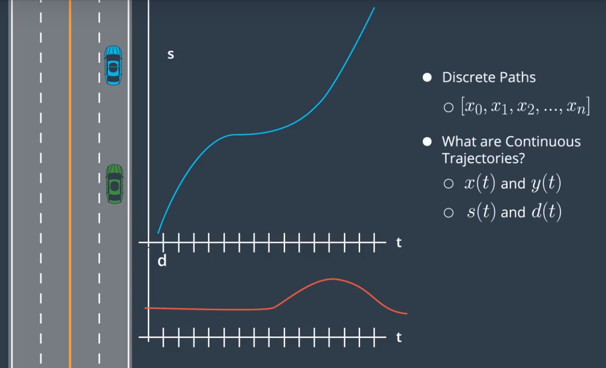
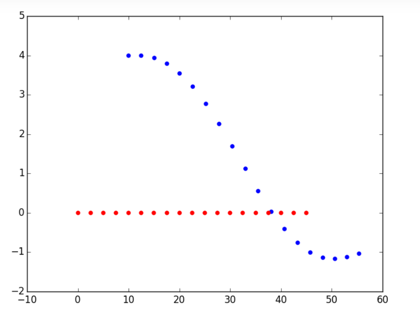

## The Motion Planning Problem

In the first lesson, you saw some best planning algorithms, which solve the motion planning problem.But we never formally defined that problem. I'd like to do that now.Now, there is a word that you might encounter quite a bit if you start reading material regarding motion planning algorithm. That word is "configuration space,"  which defines all the possible configurations of a robot in the given world. Consider the maze word you saw in the first lesson where these words were all 2D grids, the robot configuration was sometimes two dimensional when we presented it as an x_y point, and sometimes three dimensional when also including the robot's heading. In fact, the configuration space for vehicle that can become even larger depending on what motion planning algorithms we decide to use. With this idea of configuration space in mind, we can define a motion planning problem as follows. We're given three things. An initial configuration, a goal configuration and also some constraints describing how the vehicle was allowed to move, its dynamics and the description of the environment. Here, it is important to understand how this connects to the other decision-making modules that you have recently learned about. Usually, the start configuration is the current configuration of the car given to us by the localization value and the sensors that give us information about car location, speed, acceleration they can go, etcetera. The behavior layer gives us a desired end configuration, and maybe some constraints regarding where to go and at which speed. Finally, the prediction completes this problem by giving us information about how the obstacle region will evolve in time. This way, the sequence of actions that we generate takes into account other vehicles and pedestrian actions. And if we're working with a more sophisticated prediction module, how our actions might influence them. `The motion planning problem can then be defined as final sequence of feasible movements in the configuration space that's moved the robot from a start configuration to an end configuration without hitting any obstacles.` Now, I'm going to ask you to think about configuration spaces in the following questions.

## Properties of Motion Planning Algorithms


There are many classes of Motion Planning Algorithms.And today, we'll focus on one of these classes, but it is worth mentioning the others. Combinatorial Methods usually consists in dividing the free space into small pieces, and first solving the motion planning problem by connecting these atomic elements.There are very intuitive ways to find an initial approximate solution, but they usually do not scale well for large environments. Next, potential fields are reacting methods, each obstacle is going to create a sort of anti-gravity field, which makes it harder for the vehicle to come close to it. For example, you can imagine using this idea around pedestrians or bikes to include your Planning Algorithm to find Trajectories that stay away from them. The main problem with most Potential Field Methods, is that they sometimes push us into Local Minima which can prevent us from finding a solution. Optimal Control consists in trying to solve the Motion Planning Problem, and the Controlling PoD Generation in one Algorithm. Using a dynamic model for a vehicle, or start configuration, then end configuration, we want to generate a sequence of inputs. For example, steering goal and throttle input that would lead us from start to end configuration, while optimizing a cost function relative to the control inputs, such as minimizing gas consumption and relative to the configuration of the car. Such as staying at a distance from other vehicles. There are a lot of very nice ways to do that. Most of them based on Numerical Optimization Methods. However, it is hard to incorporate all of the constraints related to the other vehicles in a good enough way, in order for these Algorithms to work fast. **And finally, there are Sampling Based Methods which are what we will focus on today.** These Algorithms are very popular because they require a somewhat easier to compute definition of the free space. Sampling Based Methods use a **Collision Detection Module**, that probes the free space to see if a configuration is in collision on that. Unlike Combinatorial or Optimal Control Methods which analyzes the whole environment, not all parts of the free space need to be explored in order to find a solution. Explored parts are stored in a graph structure that can be searched with a Graph Search Algorithm like D* or A*. *Two main classes of methods can be identified as Sampling Based. Discrete methods which rely on a finer set of contributions and or inputs like a grid superposed on top of our configuration space. And Probabilistic methods which rely on the probabilistic sample of a continuous configuration space. The set of possible configurations or states that will be explored is potentially infinite, which gives some of these methods the nice property that they are Probabilistically complete. And sometimes, Probabilistically Optimal, meaning that they will always find a solution, if you allow them enough computation time. We have barely scratched the surface on all the different sorts of Planning Algorithms that exist. Far from me the idea to create an exhaustive list, I strongly encourage you to look up some of these Algorithms and learn more about how they work. Next, I'm going to present the Hybrid A Algorithm. But before that, I suggest you really watch a video you saw earlier on A and then answer a few questions about some of its properties.**

## Hybrid A* Introduction

 So the question arises, is there version of A* that can deal with the continuous nature and give us probably executable paths? This is a big big question in robot motion planning. And let me just discuss it for this one example and show you what we've done to solve this problem with **a duff probing challenge**.So the key to solving this with A* has to do with a state transition function. Suppose we are in a cell like this and you play a sequence of very small steps simulations using our continuous math from before, then a state over here might find itself right here in the corner of the next discrete state. Instead of assigning this just to the grid cell, an algorithm called Hybrid A* memorizes the exact X prime Y prime and theta prime and associate it with the grid cell over here the first time the grid cell is expanded. Then when expanding from the cell, it uses a specific starting point over here to figure out what the next cell might be. Now, it might happen that the same cell we used to get in A* maybe from over here going into a different continuous polymerization of X, Y and theta, but because in A* we tend to expand cells along the shortest path before we look the longer paths, we not just cut this off and never consider to stay over here again. Now, this leads to a lack of completeness which means there might be solutions to the navigation problem that this algorithm doesn't capture. But it does give us correctness. So as long as our motion equations are correct, the resulting paths can be executed. Now, here's a caveat. This is an approximation and it's only correct to the point that these motions equations are correct or not correct. But nevertheless, all paths that come out are nice, smooth, and curved paths. And every time we expand the grid cell, we memorize explicitly the continuous values of X prime, Y prime and theta with this grid cell.

## Hybrid A* in Practice


In the first video about Hybrid A, the update equations that we used were somewhat generic to most X Y field configuration spaces. In particular, we don't specify what Omega is. Omega is the heading rate of change. Now for some robots, it might be that we can specify any omega independently of its state. But that would mean that the robot can turn around its Z axis without constraints. For car though, this is not very realistic, and we should probably use the bicycle model. This gives us an equation for Omega like this. Here, 'L' is the distance between the front and rear axle, 'δ' is the steering angle and ⱴ is the constant positive velocity. Now, for our Hybrid A algorithm, we need to decide which configuration can be reached from the current node considered, in order to add them to the open set. In practice, we would probably use some number of steering angles between maximum left steer and maximum right steer angle.


## Hybrid A* Pseudocode

The pseudocode below outlines an implementation of the A* search algorithm using the bicycle model. The following variables and objects are used in the code but not defined there:

- `State(x, y, theta, g, f)`: An object which stores `x`, `y` coordinates, direction `theta`, and current `g` and `f` values. grid: A 2D array of 0s and 1s indicating the area to be searched. 1s correspond to obstacles, and 0s correspond to free space.
- `SPEED`: The speed of the vehicle used in the bicycle model.
- `LENGTH`: The length of the vehicle used in the bicycle model.
- `NUM_THETA_CELLS`: The number of cells a circle is divided into. This is used in keeping track of which States we have visited already.

The bulk of the hybrid A* algorithm is contained within the `search` function. The `expand` function takes a state and goal as inputs and returns a list of possible next states for a range of steering angles. This function contains the implementation of the bicycle model and the call to the A* heuristic function.

```python
def expand(state, goal):
    next_states = []
    for delta in range(-35, 40, 5): 
        # Create a trajectory with delta as the steering angle using the bicycle model:

        # ---Begin bicycle model---
        delta_rad = deg_to_rad(delta)
        omega = SPEED/LENGTH * tan(delta_rad)
        next_x = state.x + SPEED * cos(theta)
        next_y = state.y + SPEED * sin(theta)
        next_theta = normalize(state.theta + omega)
        # ---End bicycle model-----
        next_g = state.g + 1
        next_f = next_g + heuristic(next_x, next_y, goal)

        # Create a new State object with all of the "next" values.
        state = State(next_x, next_y, next_theta, next_g, next_f)
        next_states.append(state)

    return next_states

def search(grid, start, goal):
    # The opened array keeps track of the stack of States objects we are 
    # searching through.
    opened = []
    # 3D array of zeros with dimensions:
    # (NUM_THETA_CELLS, grid x size, grid y size).
    closed = [[[0 for x in range(grid[0])] for y in range(len(grid))] for cell in range(NUM_THETA_CELLS)]
    # 3D array with same dimensions. Will be filled with State() objects to keep 
    # track of the path through the grid. 
    came_from = [[[0 for x in range(grid[0])] for y in range(len(grid))] for cell in range(NUM_THETA_CELLS)]

    # Create new state object to start the search with.
    x = start.x
    y = start.y
    theta = start.theta
    g = 0
    f = heuristic(start.x, start.y, goal)
    state = State(x, y, theta, 0, f)
    opened.append(state)

    # The range from 0 to 2pi has been discretized into NUM_THETA_CELLS cells. 
    # Here, theta_to_stack_number returns the cell that theta belongs to. 
    # Smaller thetas (close to 0 when normalized  into the range from 0 to 2pi) 
    # have lower stack numbers, and larger thetas (close to 2pi whe normalized)
    # have larger stack numbers.
    stack_number = theta_to_stack_number(state.theta)
    closed[stack_number][index(state.x)][index(state.y)] = 1

    # Store our starting state. For other states, we will store the previous state 
    # in the path, but the starting state has no previous.
    came_from[stack_number][index(state.x)][index(state.y)] = state

    # While there are still states to explore:
    while opened:
        # Sort the states by f-value and start search using the state with the 
        # lowest f-value. This is crucial to the A* algorithm; the f-value 
        # improves search efficiency by indicating where to look first.
        opened.sort(key=lambda state:state.f)
        current = opened.pop(0)
        # Check if the x and y coordinates are in the same grid cell as the goal. 
        # (Note: The idx function returns the grid index for a given coordinate.)
        if (idx(current.x) == goal[0]) and (idx(current.y) == goal.y):
            # If so, the trajectory has reached the goal.
            return path

        # Otherwise, expand the current state to get a list of possible next states.
        next_states = expand(current, goal)
        for next_state in next_states:
            # If we have expanded outside the grid, skip this next_state.
            if next_states is not in the grid:
                continue
            # Otherwise, check that we haven't already visited this cell and
            # that there is not an obstacle in the grid there.
            stack_number = theta_to_stack_number(next_state.theta)
            if closed_value[stack_number][idx(next_state.x)][idx(next_state.y)] == 0 and grid[idx(next_state.x)][idx(next_state.y)] == 0:
                # The state can be added to the opened stack.
                opened.append(next_state)
                # The stack_number, idx(next_state.x), idx(next_state.y) tuple 
                # has now been visited, so it can be closed.
                closed[stack_number][idx(next_state.x)][idx(next_state.y)] = 1
                # The next_state came from the current state, and that is recorded.
                came_from[stack_number][idx(next_state.x)][idx(next_state.y)] = current
```

## Implement Hybrid A* in C++

# Implementing Hybrid A*

In this exercise, you will be provided a working implementation of a *breadth first* search algorithm which does **not** use any heuristics to improve its efficiency. Your goal is to try to make the appropriate modifications to the algorithm so that it takes advantage of heuristic functions (possibly the ones mentioned in the previous paper) to reduce the number of grid cell expansions required.

## Instructions:

1. Modify the code in 'hybrid_breadth_first.cpp' and hit `Test Run` to check your results.
2. Note the number of expansions required to solve an empty 15x15 grid (it should be about 18,000!). Modify the code to try to reduce that number. How small can you get it?

Here is one possible implementation for Hybrid A* using the "distance to goal" heuristic function. In this implementation, we have added an `f` value to the `maze_s` struct, which is set in the `expand`function. Additionally, we've added two new functions: `heuristic` and `compare_maze_s`. The `compare_maze_s` function is used for comparison of `maze_s` objects when sorting the `opened`stack.

To get an even lower number of expansions, try reducing `NUM_THETA_CELLS` in `hybrid_breadth_first.h` to reduce the total number of cells that can be searched in the `closed`array. Be careful though! Making `NUM_THETA_CELLS` too small might result in the algorithm being unable to find a path through the maze.

Another possibility for improvement is to use the regular A* algorithm to assign a cost value to each grid cell. This grid of costs can then be used as the heuristic function, which will lead to an extremely efficient search. If you are looking for additional practice, give this a try!

#### code

main.cpp

```c++
#include <iostream>
#include <vector>
#include "hybrid_breadth_first.h"

using std::cout;
using std::endl;

// Sets up maze grid
int X = 1;
int _ = 0;

/**
 * TODO: You can change up the grid maze to test different expansions.
 */
vector<vector<int>> GRID = {
  {_,X,X,_,_,_,_,_,_,_,X,X,_,_,_,_,},
  {_,X,X,_,_,_,_,_,_,X,X,_,_,_,_,_,},
  {_,X,X,_,_,_,_,_,X,X,_,_,_,_,_,_,},
  {_,X,X,_,_,_,_,X,X,_,_,_,X,X,X,_,},
  {_,X,X,_,_,_,X,X,_,_,_,X,X,X,_,_,},
  {_,X,X,_,_,X,X,_,_,_,X,X,X,_,_,_,},
  {_,X,X,_,X,X,_,_,_,X,X,X,_,_,_,_,},
  {_,X,X,X,X,_,_,_,X,X,X,_,_,_,_,_,},
  {_,X,X,X,_,_,_,X,X,X,_,_,_,_,_,_,},
  {_,X,X,_,_,_,X,X,X,_,_,X,X,X,X,X,},
  {_,X,_,_,_,X,X,X,_,_,X,X,X,X,X,X,},
  {_,_,_,_,X,X,X,_,_,X,X,X,X,X,X,X,},
  {_,_,_,X,X,X,_,_,X,X,X,X,X,X,X,X,},
  {_,_,X,X,X,_,_,X,X,X,X,X,X,X,X,X,},
  {_,X,X,X,_,_,_,_,_,_,_,_,_,_,_,_,},
  {X,X,X,_,_,_,_,_,_,_,_,_,_,_,_,_,}};

vector<double> START = {0.0,0.0,0.0};
vector<int> GOAL = {(int)GRID.size()-1, (int)GRID[0].size()-1};

int main() {
  cout << "Finding path through grid:" << endl;
  
  // Creates an Empty Maze and for testing the number of expansions with it
  for(int i = 0; i < GRID.size(); ++i) {
    cout << GRID[i][0];
    for(int j = 1; j < GRID[0].size(); ++j) {
      cout << "," << GRID[i][j];
    }
    cout << endl;
  }

  HBF hbf = HBF();

  HBF::maze_path get_path = hbf.search(GRID,START,GOAL);

  vector<HBF::maze_s> show_path = hbf.reconstruct_path(get_path.came_from, 
                                                       START, get_path.final);

  cout << "show path from start to finish" << endl;
  for(int i = show_path.size()-1; i >= 0; --i) {
      HBF::maze_s step = show_path[i];
      cout << "##### step " << step.g << " #####" << endl;
      cout << "x " << step.x << endl;
      cout << "y " << step.y << endl;
      cout << "theta " << step.theta << endl;
  }
  
  return 0;
}
```

hybrid_breadth_first.cpp

```C++
#include <math.h>
#include <algorithm>
#include <iostream>
#include <vector>
#include "hybrid_breadth_first.h"

// Initializes HBF
HBF::HBF() {}

HBF::~HBF() {}

bool HBF::compare_maze_s(const HBF::maze_s &lhs, const HBF::maze_s &rhs) {
  return lhs.f < rhs.f;
}

double HBF::heuristic(double x, double y, vector<int> &goal){
  return fabs(y - goal[0]) + fabs(x - goal[1]); //return grid distance to goal
}

int HBF::theta_to_stack_number(double theta){
  // Takes an angle (in radians) and returns which "stack" in the 3D 
  //   configuration space this angle corresponds to. Angles near 0 go in the 
  //   lower stacks while angles near 2 * pi go in the higher stacks.
  double new_theta = fmod((theta + 2 * M_PI),(2 * M_PI));
  int stack_number = (int)(round(new_theta * NUM_THETA_CELLS / (2*M_PI))) 
                   % NUM_THETA_CELLS;

  return stack_number;
}

int HBF::idx(double float_num) {
  // Returns the index into the grid for continuous position. So if x is 3.621, 
  //   then this would return 3 to indicate that 3.621 corresponds to array 
  //   index 3.
  return int(floor(float_num));
}


vector<HBF::maze_s> HBF::expand(HBF::maze_s &state, vector<int> &goal) {
  int g = state.g;
  double x = state.x;
  double y = state.y;
  double theta = state.theta;
    
  int g2 = g+1;
  vector<HBF::maze_s> next_states;

  for(double delta_i = -35; delta_i < 40; delta_i+=5) {
    double delta = M_PI / 180.0 * delta_i;
    double omega = SPEED / LENGTH * tan(delta);
    double theta2 = theta + omega;
    if(theta2 < 0) {
      theta2 += 2*M_PI;
    }
    double x2 = x + SPEED * cos(theta);
    double y2 = y + SPEED * sin(theta);
    HBF::maze_s state2;
    state2.f = g2 + heuristic(x2, y2, goal);
    state2.g = g2;
    state2.x = x2;
    state2.y = y2;
    state2.theta = theta2;
    next_states.push_back(state2);
  }

  return next_states;
}

vector< HBF::maze_s> HBF::reconstruct_path(
  vector<vector<vector<HBF::maze_s>>> &came_from, vector<double> &start, 
  HBF::maze_s &final) {

  vector<maze_s> path = {final};
  
  int stack = theta_to_stack_number(final.theta);

  maze_s current = came_from[stack][idx(final.x)][idx(final.y)];
  
  stack = theta_to_stack_number(current.theta);
  
  double x = current.x;
  double y = current.y;

  while(x != start[0] || y != start[1]) {
    path.push_back(current);
    current = came_from[stack][idx(x)][idx(y)];
    x = current.x;
    y = current.y;
    stack = theta_to_stack_number(current.theta);
  }
  
  return path;
}

HBF::maze_path HBF::search(vector< vector<int> > &grid, vector<double> &start, 
                           vector<int> &goal) {
  // Working Implementation of breadth first search. Does NOT use a heuristic
  //   and as a result this is pretty inefficient. Try modifying this algorithm 
  //   into hybrid A* by adding heuristics appropriately.

  /**
   * TODO: Add heuristics and convert this function into hybrid A*
   */
  vector<vector<vector<int>>> closed(
    NUM_THETA_CELLS, vector<vector<int>>(grid[0].size(), vector<int>(grid.size())));
  vector<vector<vector<maze_s>>> came_from(
    NUM_THETA_CELLS, vector<vector<maze_s>>(grid[0].size(), vector<maze_s>(grid.size())));
  double theta = start[2];
  int stack = theta_to_stack_number(theta);
  int g = 0;

  maze_s state;
  state.g = g;
  state.x = start[0];
  state.y = start[1];
  state.f = g + heuristic(state.x, state.y, goal);
  state.theta = theta;

  closed[stack][idx(state.x)][idx(state.y)] = 1;
  came_from[stack][idx(state.x)][idx(state.y)] = state;
  int total_closed = 1;
  vector<maze_s> opened = {state};
  bool finished = false;
  while(!opened.empty()) {
    sort(opened.begin(), opened.end(), compare_maze_s);
    maze_s current = opened[0]; //grab first elment
    opened.erase(opened.begin()); //pop first element

    int x = current.x;
    int y = current.y;

    if(idx(x) == goal[0] && idx(y) == goal[1]) {
      std::cout << "found path to goal in " << total_closed << " expansions" 
                << std::endl;
      maze_path path;
      path.came_from = came_from;
      path.closed = closed;
      path.final = current;

      return path;
    }

    vector<maze_s> next_state = expand(current, goal);

    for(int i = 0; i < next_state.size(); ++i) {
      int g2 = next_state[i].g;
      double x2 = next_state[i].x;
      double y2 = next_state[i].y;
      double theta2 = next_state[i].theta;

      if((x2 < 0 || x2 >= grid.size()) || (y2 < 0 || y2 >= grid[0].size())) {
        // invalid cell
        continue;
      }

      int stack2 = theta_to_stack_number(theta2);

      if(closed[stack2][idx(x2)][idx(y2)] == 0 && grid[idx(x2)][idx(y2)] == 0) {
        opened.push_back(next_state[i]);
        closed[stack2][idx(x2)][idx(y2)] = 1;
        came_from[stack2][idx(x2)][idx(y2)] = current;
        ++total_closed;
      }
    }
  }

  std::cout << "no valid path." << std::endl;
  HBF::maze_path path;
  path.came_from = came_from;
  path.closed = closed;
  path.final = state;

  return path;
}
```

hybrid_breadth_first.h

```C++
#ifndef HYBRID_BREADTH_FIRST_H_
#define HYBRID_BREADTH_FIRST_H_

#include <vector>

using std::vector;

class HBF {
 public:
  // Constructor
  HBF();

  // Destructor
  virtual ~HBF();

  // HBF structs
  struct maze_s {
    int g;  // iteration
    int f;
    double x;
    double y;
    double theta;
  };

  struct maze_path {
    vector<vector<vector<int>>> closed;
    vector<vector<vector<maze_s>>> came_from;
    maze_s final;
  };
  
  // HBF functions
  int theta_to_stack_number(double theta);

  int idx(double float_num);
    
  double heuristic(double x, double y, vector<int> &goal);

  static bool compare_maze_s(const HBF::maze_s &lhs, const HBF::maze_s &rhs);

  vector<maze_s> expand(maze_s &state, vector<int> &goal);

  vector<maze_s> reconstruct_path(vector<vector<vector<maze_s>>> &came_from, 
                                  vector<double> &start, HBF::maze_s &final);

  maze_path search(vector<vector<int>> &grid, vector<double> &start, 
                   vector<int> &goal);

 private:
  const int NUM_THETA_CELLS = 90;
  const double SPEED = 1.45;
  const double LENGTH = 0.5;
};

#endif  // HYBRID_BREADTH_FIRST_H_
```

## Environment Classification


Correct, you've just implemented Hybrid A* which is one of the best algorithm for finding trajectories in unstructured environments. An example of such an environment is a parking lot or a maze. And these environments tend to have less specific rules than highway or streets and also, lower driving speeds. They also do not have an obvious reference path hat corresponds to what we should be driving 90% of the time, because they change so much. On the other hand, highway or streets are very structured environments and in these environments, all motion is more constrained by predefined rules, regarding how we can move on the road. For example, the direction of traffic or lane boundaries or also speed limits. All these rules impose constraints which have to be satisfied but also for guidance regarding what the trajectory should look like. And while a style is great at finding solutions everywhere, it does not take advantage of this information. For example, the road structure itself can be used as a reference path.

## s, d, and t



## Structured Trajectory Generation Overview


## Trajectories with Boundary Condition


Our goal is to generate continuous trajectories, but how do you do that? Let's start with a native approach and then gets more realistic. Let's say, our car has been driving along the road at a constant speed for some time. The s versus time graph is just a straight line, since the velocity is constant, and the differences time graph is flat, since the car is just staying in the center of the lane. Also note that I've shifted my axis a bit so that the origin of the frame is our current positioning as TNT. This will end up being computer showing the efficient layer. Now let's say we're getting off this highway soon. So we want to change lane in order to end up there. After some delta-T which let's say it's 10 second. On the SNT-graph that goal would be here and here. The stop position and go position are fixed. They define what we call the boundary conditions of our trajectory at t equals zero, and t equals ten. If those were our only boundary conditions, then we might consider s and t-trajectory is looking like this. But it turns out that these aren't physically possible. This kink in the slope would translate in an instantaneous jumping speed which would require infinite acceleration.


## Jerk Minimizing Trajectories


What is a jerk minimizing trajectory? An interesting and useful fact to us is that it is relatively easy to compute a jerk optimal trajectory in one dimension. In fact, consider a function s of t different from time zero to time tf. and recall that jerk is a third relative of position. So the total jerk accumulated over the duration of this trajectory is given by this equation. And here, we want to analyze both positive and negative jerk. Therefore, we're going to look at total square jerk. Our problem is then to find a function s of t that minimizes this integral.which means that all minimum jerk trajectories can be represented as a fifth order polynomial like this.


You can see this equation has six coefficients and six coefficients means six tuneable parameters that we can choose from in order to define the shape of a 1D trajectory. And in practice, we use them to specify the boundary conditions of our trajectory. The things we'd like to constrain are the initial position, velocity, and acceleration as well as the final position, velocity and acceleration. Now, this is just the 1D representing the longitude of displacement. But, the same for the lateral displacement applies. This gives us 12 variables to pick in order to fully define the motion of our vehicle in S&D over time.

## Derivation Overview


In the previous video, I showed you that the position of a Jerk minimizing trajectory is given by quintic polynomial. In this video, I'm going to present a quick and non-rigorous walk-through of how we find the six coefficients that describe this polynomial. It is not essential that you remember the details of this, but you might find it interesting. First, we differentiate the equations of the position in order to get the equations for the velocity. And then, we differentiate it again in order to get the equation for the acceleration. Now, we could just plug in our six boundary conditions to get the six equations. But first, we're going to do something that will make our life a little bit easier. 


We're going to set the initial time as zero. And when we do that, we find this, which means that three of four unknowns don't need to be identified anymore, which reduces the problem from six unknowns to three. And it simplifies those three trajectories by removing three of the unknowns here. We can gather the known terms into functions of the start boundary conditions to make it look like a bit cleaner. The C1, C2, and C3 terms are functions of the initial conditions. What remains is that we only have to identify three parameters that depend only on our end boundary condition. And these equations look like this. And we know the final position, velocity, and acceleration at time TF since those are all the quantities that we picked. Since we know them, a more useful way to think of these equations is like this. Where I have deliberately separated the known quantities from the unknown variables that we wish to determine. And this is starting to look like a very solvable system of three equations. The best way to solve this is with a matrix that looks like this. And this problem can be solved by inverting this matrix using any matrix mathematical library which we'll do later.

## Derivation Details 2


## Polynomial Trajectory Generation


I am soon going to ask you to implement a polynomial solver to generate Jerk minimizing trajectories. But first, I want to show you how it's being used. Let's consider the S coordinates first. As an input, it takes the current vehicle state, the goal state, and the duration. And as an output, it will generate six coefficients, which uniquely define the polynomial that describes the longitudinal trajectory. Similarly, we feed input parameters to our solver regarding lateral configurations and compute the lateral trajectory.


 We can use this approach in a situation like this one, you have traffic and a self-driving car. And let's say that the requested behavior is to pass the vehicle in front of us. With polynomial trajectory generation, we take the current configuration of the car along with its velocity and acceleration as our start state. And then we specify a valid goal state that leads our vehicle in the other lane. We ship these states into our polynomial solver along with the desired duration that will allow for the maneuver. And we get a Jerk minimizing trajectory to the goal.

## Implement Quintic Polynomial Solver C++

#### Implement a Quintic Polynomial Solver

In this exercise you will implement a quintic polynomial solver. This will let you take boundary conditions as input and generate a polynomial trajectory which matches those conditions with minimal jerk.

#### Inputs

Your solver will take three inputs.


#### Instructions

1. Implement the `JMT(start, end, T)` function in `main.cpp`
2. Hit `Test Run` and see if you're correct!

#### Tips

Remember, you are solving a system of equations: matrices will be helpful! The Eigen library used from Sensor Fusion is included.

The equations for position, velocity, and acceleration are given by:


#### code

main.cpp

```C++
#include <cmath>
#include <iostream>
#include <vector>

#include "Dense"
#include "grader.h"

using std::vector;
using Eigen::MatrixXd;
using Eigen::VectorXd;

/**
 * TODO: complete this function
 */
vector<double> JMT(vector<double> &start, vector<double> &end, double T) {
  /**
   * Calculate the Jerk Minimizing Trajectory that connects the initial state
   * to the final state in time T.
   *
   * @param start - the vehicles start location given as a length three array
   *   corresponding to initial values of [s, s_dot, s_double_dot]
   * @param end - the desired end state for vehicle. Like "start" this is a
   *   length three array.
   * @param T - The duration, in seconds, over which this maneuver should occur.
   *
   * @output an array of length 6, each value corresponding to a coefficent in 
   *   the polynomial:
   *   s(t) = a_0 + a_1 * t + a_2 * t**2 + a_3 * t**3 + a_4 * t**4 + a_5 * t**5
   *
   * EXAMPLE
   *   > JMT([0, 10, 0], [10, 10, 0], 1)
   *     [0.0, 10.0, 0.0, 0.0, 0.0, 0.0]
   */
  MatrixXd A = MatrixXd(3, 3);
  A << T*T*T, T*T*T*T, T*T*T*T*T,
       3*T*T, 4*T*T*T,5*T*T*T*T,
       6*T, 12*T*T, 20*T*T*T;
    
  MatrixXd B = MatrixXd(3,1);     
  B << end[0]-(start[0]+start[1]*T+.5*start[2]*T*T),
       end[1]-(start[1]+start[2]*T),
       end[2]-start[2];
          
  MatrixXd Ai = A.inverse();
  
  MatrixXd C = Ai*B;
  
  vector <double> result = {start[0], start[1], .5*start[2]};

  for(int i = 0; i < C.size(); ++i) {
    result.push_back(C.data()[i]);
  }

  return result;
}

int main() {

  // create test cases
  vector< test_case > tc = create_tests();

  bool total_correct = true;

  for(int i = 0; i < tc.size(); ++i) {
    vector<double> jmt = JMT(tc[i].start, tc[i].end, tc[i].T);
    bool correct = close_enough(jmt, answers[i]);
    total_correct &= correct;
  }

  if(!total_correct) {
    std::cout << "Try again!" << std::endl;
  } else {
    std::cout << "Nice work!" << std::endl;
  }

  return 0;
}
```

grader.h

```C++
#ifndef GRADER_H
#define GRADER_H

#include <cmath>
#include <vector>

using std::vector;

struct test_case {
    vector<double> start;
    vector<double> end;
    double T;
};

bool close_enough(vector<double> &poly, vector<double> &target_poly, 
                  double eps=0.01) {
  if (poly.size() != target_poly.size()) {
    std::cout << "Your solution didn't have the correct number of terms" 
              << std::endl;
    return false;
  }

  for (int i = 0; i < poly.size(); ++i) {
    double diff = poly[i]-target_poly[i];
    if (abs(diff) > eps) {
      std::cout << "At least one of your terms differed from target by more than " 
                << eps << std::endl;
      return false;
    }
  }

  return true;
}

vector<test_case> create_tests() {
  // Create test case vector
  vector<test_case> tc;

  test_case tc1;
  tc1.start = {0,10,0};
  tc1.end = {10,10,0};
  tc1.T = 1;
  tc.push_back(tc1);

  test_case tc2;
  tc2.start = {0,10,0};
  tc2.end = {20,15,20};
  tc2.T = 2;
  tc.push_back(tc2);

  test_case tc3;
  tc3.start = {5,10,2};
  tc3.end = {-30,-20,-4};
  tc3.T = 5;
  tc.push_back(tc3);
  
  return tc;
}

vector<vector<double>> answers = {{0.0, 10.0, 0.0, 0.0, 0.0, 0.0},
                                  {0.0,10.0,0.0,0.0,-0.625,0.3125},
                                  {5.0,10.0,1.0,-3.0,0.64,-0.0432}};

#endif  // GRADER_H
```

## Implementing Feasibility


Here we're not going to discuss how to solve these feasibility check exactly. But I want to give you a few hints about how to do some initial validation for your trajectory. In order to do so, we're going to neglect the curvature of the road and assume it is locally straight. Regarding longitudinal acceleration, we make the additional assumption that our heading is pretty much aligned with the road. This allows us to say that S doubled dots is the longitude acceleration of the car. Therefore, we need to check that at any point of the trajectory, this acceleration is less than the maximum acceleration that the engine would need to supply, and more than the maximum braking deceleration of the car. Right now, this could be a fixed value. In real life however, this should probably be computed using information about the friction of the road. Similarly, for lateral acceleration, we can check that all d double dot values are less than a fixed lateral acceleration value that can be set for comfort, or to avoid any risk of rollover in our car. Regarding steering angle, the bicycle model tells us that there's a nice relationship between the steering angle of the car and the radius of the circle of curvature, where L is the distance between the wheel axis and R is the circle radius. The curvature is then given by this formula, and therefore the maximum curvature allowed at any point of the trajectory is given by this equation. If you remember, in the reading assignment about [inaudible] the curvature for path is defined like this, where Δφi is the heading difference between two points of the trajectory and Δχi is the distance between them. Finally the velocity is checked against values specified by the map or the behavioral layer. For example, we could use the speed limit of the road in most cases. That gives us a maximal velocity but also sometimes, we need a minimal velocity like on highways where we don't want to drive too slow or we're backing up, negative S dot is not allowed.

## Polynomial Trajectory Reading (optional)

f you are interested in learning more about PTG, I've included a link to a paper (below) titled "Optimal Trajectory Generation for Dynamic Street Scenarios in a Frenet Frame". It is short and discusses some interesting (and potentially useful) topics like:

1. Cost Functions.
2. Differences between high speed and low speed trajectory generation.
3. Implementation of specific maneuvers relevant to highway driving like following, merging, and velocity keeping.
4. How to combining lateral and longitudinal trajectories.
5. A derivation of the transformation from Frenet coordinates to global coordinates (in the appendix).


#### 辅助材料

[ Optimal Trajectory Generation For Dynamic Street Scenarios In A Frenet Frame](http://video.udacity-data.com.s3.amazonaws.com/topher/2017/July/595fd482_werling-optimal-trajectory-generation-for-dynamic-street-scenarios-in-a-frenet-frame/werling-optimal-trajectory-generation-for-dynamic-street-scenarios-in-a-frenet-frame.pdf)

## Polynomial Trajectory Generation Playground

# Polynomial Playground (making PTG work)

Before you begin the final project we'd like to give you a chance to play around with cost function design and weight tweaking. In the Python code you will be provided, you will have a working Polynomial Trajectory Generator. You can see it in action by doing the following:

### Getting Started

1. Download the project code by clicking **TrajectoryExercise2** at the bottom of this page.
2. From the project's directory, run `python evaluate_ptg.py`. You should see a plot similar to the one below. This plot shows the s (x-axis) and d(y-axis) trajectories followed by a vehicle in traffic (red) and a self driving car (blue).



In this situation, the self driving car was trying to get behind the target vehicle, but the cost functions it was using weren't weighted appropriately and so it didn't behave as expected.

### Fixing the Problem(s)

There are 5 files in the provided code. You'll probably want to start by modifying cost function weights in `ptg.py` but may also want to add cost functions of your own. As a bonus challenge try implementing this same code in C++.

**File Descriptions**

1. `ptg.py` - The primary code for generating a polynomial trajectory for some constraints. This is also where weights are assigned to cost functions. Adjusting these weights (and possibly adding new cost functions), can have a big effect on vehicle behavior.
2. `cost_functions.py` - This file contains many cost functions which are used in ptg.py when selecting the best trajectory. Some cost functions aren't yet implemented...
3. `evaluate_ptg.py` - This file sets a start state, goal, and traffic conditions and runs the PTG code. Feel free to modify the goal, add traffic, etc... to test your vehicle's trajectory generation ability.
4. `constants.py` - constants like speed limit, vehicle size, etc...
5. `helpers.py` - helper functions used by other files.


#### 辅助材料

[ Trajectoryexercise2](http://video.udacity-data.com.s3.amazonaws.com/topher/2017/October/59d5bfcb_trajectoryexercise2/trajectoryexercise2.zip)

[ Trajectoryexercise2_python3](https://d17h27t6h515a5.cloudfront.net/topher/2017/December/5a3ea459_trajectoryexercise2-python3/trajectoryexercise2-python3.zip)

## Bonus Round: Path Planning [Optional]

## Additional Resources on Path Planning

Nice work reaching the end of the path planning content! While you still have the project left to do here, we're also providing some additional resources and recent research on the topic that you can come back to if you have time later on.

Reading research papers is a great way to get exposure to the latest and greatest in the field, as well as expand your learning. However, just like the project ahead, it's often best to *learn by doing* - if you find a paper that really excites you, try to implement it (or even something better) yourself!


##### Optional Reading

All of these are completely optional reading - you could spend hours reading through the entirety of these! We suggest moving onto the project first so you have what you’ve learned fresh on your mind, before coming back to check these out.

We've categorized these papers to hopefully help you narrow down which ones might be of interest, as well including their *Abstract* section, which summarizes the paper.

------


### Indoors

[Intention-Net: Integrating Planning and Deep Learning for Goal-Directed Autonomous Navigation](https://arxiv.org/abs/1710.05627) by S. W. Gao, et. al.

> **Abstract:** How can a delivery robot navigate reliably to a destination in a new office building, with minimal prior information? To tackle this challenge, this paper introduces a two-level hierarchical approach, which integrates model-free deep learning and model-based path planning. At the low level, a neural-network motion controller, called the intention-net, is trained end-to-end to provide robust local navigation. The intention-net maps images from a single monocular camera and "intentions" directly to robot controls. At the high level, a path planner uses a crude map, e.g., a 2-D floor plan, to compute a path from the robot's current location to the goal. The planned path provides intentions to the intention-net. Preliminary experiments suggest that the learned motion controller is robust against perceptual uncertainty and by integrating with a path planner, it generalizes effectively to new environments and goals.

------


### City Navigation

[Learning to Navigate in Cities Without a Map](https://arxiv.org/abs/1804.00168) by P. Mirowski, et. al.

> **Abstract:** Navigating through unstructured environments is a basic capability of intelligent creatures, and thus is of fundamental interest in the study and development of artificial intelligence. Long-range navigation is a complex cognitive task that relies on developing an internal representation of space, grounded by recognizable landmarks and robust visual processing, that can simultaneously support continuous self-localization ("I am here") and a representation of the goal ("I am going there"). Building upon recent research that applies deep reinforcement learning to maze navigation problems, we present an end-to-end deep reinforcement learning approach that can be applied on a city scale. [...] We present an interactive navigation environment that uses Google StreetView for its photographic content and worldwide coverage, and demonstrate that our learning method allows agents to learn to navigate multiple cities and to traverse to target destinations that may be kilometers away. [...]

------


### Intersections

[A Look at Motion Planning for Autonomous Vehicles at an Intersection](https://arxiv.org/abs/1806.07834) by S. Krishnan, et. al.

> **Abstract:** Autonomous Vehicles are currently being tested in a variety of scenarios. As we move towards Autonomous Vehicles, how should intersections look? To answer that question, we break down an intersection management into the different conundrums and scenarios involved in the trajectory planning and current approaches to solve them. Then, a brief analysis of current works in autonomous intersection is conducted. With a critical eye, we try to delve into the discrepancies of existing solutions while presenting some critical and important factors that have been addressed. Furthermore, open issues that have to be addressed are also emphasized. We also try to answer the question of how to benchmark intersection management algorithms by providing some factors that impact autonomous navigation at intersection.

------


### Planning in Traffic with Deep Reinforcement Learning

[DeepTraffic: Crowdsourced Hyperparameter Tuning of Deep Reinforcement Learning Systems for Multi-Agent Dense Traffic Navigation](https://arxiv.org/abs/1801.02805) by L. Fridman, J. Terwilliger and B. Jenik

> **Abstract:** We present a traffic simulation named DeepTraffic where the planning systems for a subset of the vehicles are handled by a neural network as part of a model-free, off-policy reinforcement learning process. The primary goal of DeepTraffic is to make the hands-on study of deep reinforcement learning accessible to thousands of students, educators, and researchers in order to inspire and fuel the exploration and evaluation of deep Q-learning network variants and hyperparameter configurations through large-scale, open competition. This paper investigates the crowd-sourced hyperparameter tuning of the policy network that resulted from the first iteration of the DeepTraffic competition where thousands of participants actively searched through the hyperparameter space.

