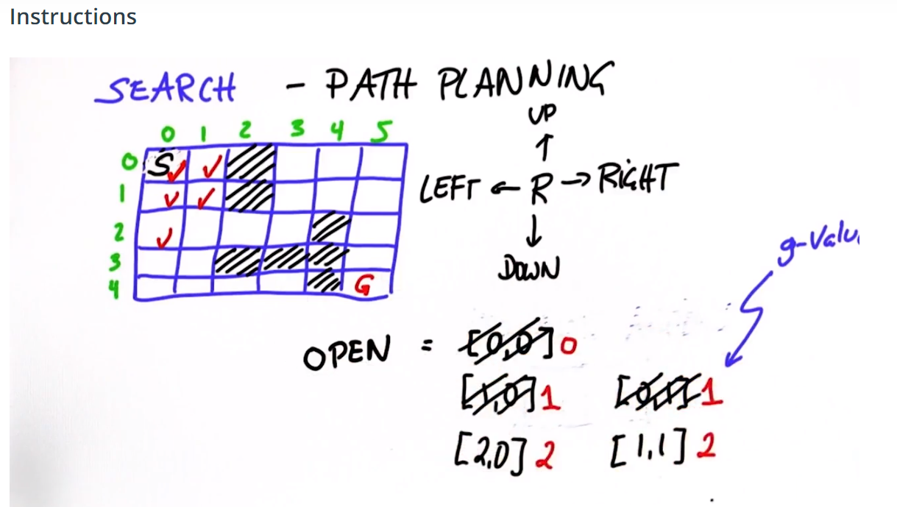

# About this Lesson

This lesson is taught by Sebastian Thrun (Udacity's former CEO) and comes from one of Udacity's first courses. The production style is a little different than what you may be used to but the content is very good.

This lesson covers **discrete** path planning and in the last lesson you will learn about **continuous** path planning. Even though the real world is continuous, there are many situations where *discretizing* the world makes it easier and computationally faster to solve path planning problems.

In addition to the practical benefits of these algorithms, it's also conceptually useful to learn about them because they deal with some of the same concepts that we will keep coming back to in this lesson. Those concepts include:

- **Cost functions** and how to include human insights (like "it's easier to make right turns than left turns") into our planning algorithms.

- **Optimality** and the tradeoffs associated with finding *the best* solution vs finding a solution that is *good enough*.

- **Online vs Offline algorithms** and how we can avoid complex computation on the road by precomputing best paths whenever possible.

  

## First Search Program



```python
# ----------
# User Instructions:
# 
# Define a function, search() that returns a list
# in the form of [optimal path length, row, col]. For
# the grid shown below, your function should output
# [11, 4, 5].
#
# If there is no valid path from the start point
# to the goal, your function should return the string
# 'fail'
# ----------

# Grid format:
#   0 = Navigable space
#   1 = Occupied space


grid = [[0, 0, 1, 0, 0, 0],
        [0, 0, 0, 0, 0, 0],
        [0, 0, 1, 0, 1, 0],
        [0, 0, 1, 0, 1, 0],
        [0, 0, 1, 0, 1, 0]]
init = [0, 0]
goal = [len(grid)-1, len(grid[0])-1]
cost = 1

delta = [[-1, 0], # go up
         [ 0,-1], # go left
         [ 1, 0], # go down
         [ 0, 1]] # go right

delta_name = ['^', '<', 'v', '>']

def search(grid,init,goal,cost):
    # ----------------------------------------
    # insert code here
    # ----------------------------------------
    # open list elements are of the type:[g, x, y]
    closed = [[0 for row in range(len(grid[0]))] for col in range(len(grid))] 
    expand = [[-1 for row in range(len(grid[0]))] for col in range(len(grid))]
    closed[init[0]][init[1]] = 1
    
    x = init[0]
    y = init[1]
    g = 0
    
    open_list = [[g, x, y]]
    
    
    found  = False  # flat that is set when search complete
    resign = False   # flat we can't find expand
    count = 0
    
    while not found and not resign:
        #check if we still have elements on open list
        if len(open_list) == 0:
            resign = True
            print("fail")
        else:
            # remove node from list
            open_list.sort()
            open_list.reverse()
            next_element= open_list.pop()
            
            x = next_element[1]
            y = next_element[2]
            g = next_element[0]
            expand[x][y] = count
            count += 1
            
            #check if we are done
            if x == goal[0] and y == goal[1]:
                found = True
                print(next_element)
            else:
                # expanding winning element and add new open list
                for i in range(len(delta)):
                  
                    x2 = x + delta[i][0]
                    y2 = y + delta[i][1]
                 
                    if x2 >= 0 and x2 < len(grid) and y2 >= 0 and y2 < len(grid[0]):
                       
                        if closed[x2][y2] == 0 and grid[x2][y2] == 0:
                            g2 = g + cost
                            open_list.append([g2, x2, y2])
                            closed[x2][y2] = 1
                            
                            
    for i in range(len(expand)):
        print(expand[i])


```

## Print Path

```python
# -----------
# User Instructions:
#
# Modify the the search function so that it returns
# a shortest path as follows:
# 
# [['>', 'v', ' ', ' ', ' ', ' '],
#  [' ', '>', '>', '>', '>', 'v'],
#  [' ', ' ', ' ', ' ', ' ', 'v'],
#  [' ', ' ', ' ', ' ', ' ', 'v'],
#  [' ', ' ', ' ', ' ', ' ', '*']]
#
# Where '>', '<', '^', and 'v' refer to right, left, 
# up, and down motions. Note that the 'v' should be 
# lowercase. '*' should mark the goal cell.
#
# You may assume that all test cases for this function
# will have a path from init to goal.
# ----------
grid = [[0, 0, 1, 0, 0, 0],
        [0, 0, 1, 0, 0, 0],
        [0, 0, 0, 0, 0, 0],
        [0, 0, 0, 0, 0, 0],
        [0, 0, 0, 0, 0, 0]]
init = [0, 0]
goal = [len(grid)-1, len(grid[0])-1]
cost = 1

delta = [[-1, 0], # go up
         [ 0,-1], # go left
         [ 1, 0], # go down
         [ 0, 1]] # go right

delta_name = ['^', '<', 'v', '>']

def search(grid,init,goal,cost):
    # ----------------------------------------
    # insert code here
    # ----------------------------------------
    # open list elements are of the type:[g, x, y]
    closed = [[0 for row in range(len(grid[0]))] for col in range(len(grid))] 
    action = [[-1 for row in range(len(grid[0]))] for col in range(len(grid))]
  
    closed[init[0]][init[1]] = 1
    
    x = init[0]
    y = init[1]
    g = 0
    
    open_list = [[g, x, y]]
    
    
    found  = False  # flat that is set when search complete
    resign = False   # flat we can't find expand
    count = 0
    
    while not found and not resign:
        #check if we still have elements on open list
        if len(open_list) == 0:
            resign = True
            print("fail")
        else:
            # remove node from list
            open_list.sort()
            open_list.reverse()
            next_element= open_list.pop()
            
            x = next_element[1]
            y = next_element[2]
            g = next_element[0]
            
            
            #check if we are done
            if x == goal[0] and y == goal[1]:
                found = True
                print(next_element)
            else:
                # expanding winning element and add new open list
                for i in range(len(delta)):
                  
                    x2 = x + delta[i][0]
                    y2 = y + delta[i][1]
                 
                    if x2 >= 0 and x2 < len(grid) and y2 >= 0 and y2 < len(grid[0]):
                       
                        if closed[x2][y2] == 0 and grid[x2][y2] == 0:
                            g2 = g + cost
                            open_list.append([g2, x2, y2])
                            closed[x2][y2] = 1
                            action[x2][y2] = i
    # print the best path
    policy = [[' ' for row in range(len(grid[0]))] for col in range(len(grid))]
    x = goal[0]
    y = goal[1]
    policy[x][y] = '*'
    
    while x != init[0] or y != init[1]:
        x2 = x - delta[action[x][y]][0]
        y2 = y - delta[action[x][y]][1]
        policy[x2][y2] = delta_name[action[x][y]]
        x = x2
        y = y2
    
    for i in range(len(policy)):
        print(policy[i])
    
    for i in range(len(action)):
        print(action[i])
    
```

## A* Star

```python
# -----------
# User Instructions:
#
# Modify the the search function so that it becomes
# an A* search algorithm as defined in the previous
# lectures.
#
# Your function should return the expanded grid
# which shows, for each element, the count when
# it was expanded or -1 if the element was never expanded.
# 
# If there is no path from init to goal,
# the function should return the string 'fail'
# ----------

grid = [[0, 1, 0, 0, 0, 0],
        [0, 1, 0, 0, 0, 0],
        [0, 1, 0, 0, 0, 0],
        [0, 1, 0, 0, 0, 0],
        [0, 0, 0, 0, 1, 0]]
heuristic = [[9, 8, 7, 6, 5, 4],
             [8, 7, 6, 5, 4, 3],
             [7, 6, 5, 4, 3, 2],
             [6, 5, 4, 3, 2, 1],
             [5, 4, 3, 2, 1, 0]]

init = [0, 0]
goal = [len(grid)-1, len(grid[0])-1]
cost = 1

delta = [[-1, 0 ], # go up
         [ 0, -1], # go left
         [ 1, 0 ], # go down
         [ 0, 1 ]] # go right

delta_name = ['^', '<', 'v', '>']

def search(grid,init,goal,cost,heuristic):
    # ----------------------------------------
    # modify the code below
    # ----------------------------------------
    closed = [[0 for col in range(len(grid[0]))] for row in range(len(grid))]
    expand = [[-1 for col in range(len(grid[0]))] for row in range(len(grid))]

    x = init[0]
    y = init[1]
    g = 0
    h = heuristic[x][y]
    f = g + h

    open = [[f, x, y]]

    found = False  # flag that is set when search is complete
    resign = False # flag set if we can't find expand
    count = 0
    
    while not found and not resign:
        if len(open) == 0:
            resign = True
            return "Fail"
        else:
            open.sort()
            open.reverse()
            next = open.pop()
            x = next[1]
            y = next[2]
            f = next[0]
            expand[x][y] = count
            count += 1
            
            if x == goal[0] and y == goal[1]:
                found = True
            else:
                for i in range(len(delta)):
                    x2 = x + delta[i][0]
                    y2 = y + delta[i][1]
                    if x2 >= 0 and x2 < len(grid) and y2 >=0 and y2 < len(grid[0]):
                        if closed[x2][y2] == 0 and grid[x2][y2] == 0:
                            g2 = g + cost
                            h2 = heuristic[x2][y2]
                            f2 = g2 + h2
                            open.append([f2, x2, y2])
                            closed[x2][y2] = 1

    return expand
    
expand = search(grid,init,goal,cost,heuristic)
print(expand)

```

## Dynamic Programming

I now want to teach you an alternative method for planning. This alternative method has a number of advantages and a number of disadvantages. It's called dynamic programming, and just like A-star, it's going to find you the shortest path. You give it a map of the environment as in A-star, one or more goal positions-let's assume just one goal position. What it outputs is the best path from any possible starting location. This planning technique is not just limited to a single start location, but to any start location. Why would we worry about this? Let me give you an example. Suppose you are the Google self-driving car in an environment just like this. You're in this little street over here, and you're asked to turn right, but your goal is right over here. As before, there are two different lanes over here--a left turn lane and a straight lane. If you reach the straight lane, the only way to get to the goal is to go around the block over here and proceed in this direction. You've seen this example before. Now, the point I want to make is a different one. That is, your attempt to do a lane shift over here might fail. Why would it fail? Well, it could be there's a big, big truck in this lane over here, and as you go into the right lane when you're waiting for the truck to disappear, there are these people behind you that honk their horns. You really don't want to wait for the truck to disappear. That means the environment is stochastic. The outcomes of actions are non-deterministic. In our planning so far we ignored this, but in reality that's the case. In reality, you might find yourself--wow, I'm over here. How did that happen? Well, it's happened because the world is stochastic, and this truck over here--this stupid truck---didn't let you in. What that means is you need a plan not just for the most likely position but you might need a plan for other positions as well. What dynamic programming gives you is a plan for every position. If we redraw this environment as a grid with a goal location and certain obstacles, they dynamic programming gives you an optimal action to do at every single grid cell. As you can see, each grid cell now has a label. That label is often called policy, and policy is a function that maps the grid cell into an action with the action in this case as a move left, move down, move right, or move up. Now, we will compute a policy using dynamic programming. That is, given a grid world like this and a goal state like that, we will write software that will output for each of the grid cells what the best thing is to do should the robot find itself there. That requires a different algorithm than A-star. It happens to be a more computation involved algorithm. As I said before, it's called dynamic programming for robot path planning.

## Computing Value

```python
# ----------
# User Instructions:
# 
# Create a function compute_value which returns
# a grid of values. The value of a cell is the minimum
# number of moves required to get from the cell to the goal. 
#
# If a cell is a wall or it is impossible to reach the goal from a cell,
# assign that cell a value of 99.
# ----------

grid = [[0, 1, 0, 0, 0, 0],
        [0, 1, 0, 0, 0, 0],
        [0, 1, 0, 0, 0, 0],
        [0, 1, 0, 0, 0, 0],
        [0, 0, 0, 0, 1, 0]]
goal = [len(grid)-1, len(grid[0])-1]
cost = 1 # the cost associated with moving from a cell to an adjacent one

delta = [[-1, 0 ], # go up
         [ 0, -1], # go left
         [ 1, 0 ], # go down
         [ 0, 1 ]] # go right

delta_name = ['^', '<', 'v', '>']

def compute_value(grid,goal,cost):
    # ----------------------------------------
    # insert code below
    # ----------------------------------------
    
    # make sure your function returns a grid of values as 
    # demonstrated in the previous video.
    value = [[99 for j in range(len(grid[0]))] for i in range(len(grid))]
    
    change = True
    
    while change:
        change = False
        
        for x in range(len(grid)):
            
            for y in range(len(grid[0])):
                if goal[0] == x and goal[1] == y:
                    if value[x][y] > 0:
                        value[x][y] = 0
                        change = True
                elif grid[x][y] == 0:
                    for i in range(len(delta)):
                        x2 = x + delta[i][0]
                        y2 = y + delta[i][1]
                    
                        if x2 >= 0 and x2 < len(grid) and y2 >= 0 and y2 < len(grid[0]) and grid[x2][y2] == 0:
                           
                            v2 = value[x2][y2] + cost
                        
                            if v2 < value[x][y]:
                                change = True
                                value[x][y] = v2

    return value
```

## Optimum Policy

```python
# ----------
# User Instructions:
# 
# Write a function optimum_policy that returns
# a grid which shows the optimum policy for robot
# motion. This means there should be an optimum
# direction associated with each navigable cell from
# which the goal can be reached.
# 
# Unnavigable cells as well as cells from which 
# the goal cannot be reached should have a string 
# containing a single space (' '), as shown in the 
# previous video. The goal cell should have '*'.
# ----------

grid = [[0, 1, 0, 0, 0, 0],
        [0, 1, 0, 0, 0, 0],
        [0, 1, 0, 0, 0, 0],
        [0, 1, 0, 0, 0, 0],
        [0, 0, 0, 0, 1, 0]]
init = [0, 0]
goal = [len(grid)-1, len(grid[0])-1]
cost = 1 # the cost associated with moving from a cell to an adjacent one

delta = [[-1, 0 ], # go up
         [ 0, -1], # go left
         [ 1, 0 ], # go down
         [ 0, 1 ]] # go right

delta_name = ['^', '<', 'v', '>']

def optimum_policy(grid,goal,cost):
    # ----------------------------------------
    # modify code below
    # ----------------------------------------
    value = [[99 for row in range(len(grid[0]))] for col in range(len(grid))]
    policy = [[' ' for row in range(len(grid[0]))] for col in range(len(grid))]
    #policy[goal[0]][goal[1]] = '*'
    change = True

    while change:
        change = False

        for x in range(len(grid)):
            for y in range(len(grid[0])):
                if goal[0] == x and goal[1] == y:
                    if value[x][y] > 0:
                        value[x][y] = 0
                        policy[x][y] = '*'

                        change = True

                elif grid[x][y] == 0:
                    for a in range(len(delta)):
                        x2 = x + delta[a][0]
                        y2 = y + delta[a][1]

                        if x2 >= 0 and x2 < len(grid) and y2 >= 0 and y2 < len(grid[0]) and grid[x2][y2] == 0:
                            v2 = value[x2][y2] + cost

                            if v2 < value[x][y]:
                                change = True
                                value[x][y] = v2
                                policy[x][y] = delta_name[a]

    return policy

policy = optimum_policy(grid,goal,cost)
for i in range(len(policy)):
    print(policy[i])

```

## Left Turn Policy

```python
# ----------
# User Instructions:
# 
# Implement the function optimum_policy2D below.
#
# You are given a car in grid with initial state
# init. Your task is to compute and return the car's 
# optimal path to the position specified in goal; 
# the costs for each motion are as defined in cost.
#
# There are four motion directions: up, left, down, and right.
# Increasing the index in this array corresponds to making a
# a left turn, and decreasing the index corresponds to making a 
# right turn.

forward = [[-1,  0], # go up
           [ 0, -1], # go left
           [ 1,  0], # go down
           [ 0,  1]] # go right
forward_name = ['up', 'left', 'down', 'right']

# action has 3 values: right turn, no turn, left turn
action = [-1, 0, 1]
action_name = ['R', '#', 'L']

# EXAMPLE INPUTS:
# grid format:
#     0 = navigable space
#     1 = unnavigable space 
grid = [[1, 1, 1, 0, 0, 0],
        [1, 1, 1, 0, 1, 0],
        [0, 0, 0, 0, 0, 0],
        [1, 1, 1, 0, 1, 1],
        [1, 1, 1, 0, 1, 1]]

init = [4, 3, 0] # given in the form [row,col,direction]
                 # direction = 0: up
                 #             1: left
                 #             2: down
                 #             3: right
                
goal = [2, 0] # given in the form [row,col]

cost = [2, 1, 20] # cost has 3 values, corresponding to making 
                  # a right turn, no turn, and a left turn

# EXAMPLE OUTPUT:
# calling optimum_policy2D with the given parameters should return 
# [[' ', ' ', ' ', 'R', '#', 'R'],
#  [' ', ' ', ' ', '#', ' ', '#'],
#  ['*', '#', '#', '#', '#', 'R'],
#  [' ', ' ', ' ', '#', ' ', ' '],
#  [' ', ' ', ' ', '#', ' ', ' ']]
# ----------

# ----------------------------------------
# modify code below
# ----------------------------------------

def optimum_policy2D(grid,init,goal,cost):
    value = [[[999 for row in range(len(grid[0]))] for col in range(len(grid))],
             [[999 for row in range(len(grid[0]))] for col in range(len(grid))],
             [[999 for row in range(len(grid[0]))] for col in range(len(grid))],
             [[999 for row in range(len(grid[0]))] for col in range(len(grid))]]
    
    policy = [[[' ' for row in range(len(grid[0]))] for col in range(len(grid))],
             [[' ' for row in range(len(grid[0]))] for col in range(len(grid))],
             [[' ' for row in range(len(grid[0]))] for col in range(len(grid))],
             [[' ' for row in range(len(grid[0]))] for col in range(len(grid))]]
    
    policy2D = [[' ' for row in range(len(grid[0]))] for col in range(len(grid))]
    
    change = True
    while change:
        change = False

        for x in range(len(grid)):
            for y in range(len(grid[0])):
                for orient in range(len(forward)):
                    if goal[0] == x and goal[1] == y:
                        if value[orient][x][y] > 0:
                            change = True
                            value[orient][x][y] = 0
                            policy[orient][x][y] = '*'

                    elif grid[x][y] == 0:
                       
                        for i in range(len(action)):
                        
                            o2 = (orient + action[i]) % 4
                            x2 = x + forward[o2][0]
                            y2 = y + forward[o2][1]
                            

                            if x2 >= 0 and x2 < len(grid) and y2 >= 0 and y2 < len(grid[0]) and grid[x2][y2] == 0:
                                v2 = value[o2][x2][y2] + cost[i]
                                

                                if v2 < value[orient][x][y]:
                                    value[orient][x][y] = v2
                                    policy[orient][x][y] = action_name[i]
                                    change = True
  
    #print(value)
    #print(policy)
    
    x = init[0]
    y = init[1]
    orient = init[2]
    policy2D[x][y] = policy[orient][x][y]
    
    while policy[orient][x][y] != '*':
        if policy[orient][x][y] == '#':
            o2 = orient
        elif policy[orient][x][y] == 'R':
            o2 = (orient - 1) % 4       # trun right
        elif policy[orient][x][y] == 'L':
            o2 = (orient + 1) % 4       # turn left
        x = x + forward[o2][0]
        y = y + forward[o2][1]
        orient = o2
        
        policy2D[x][y] = policy[orient][x][y]  

    return policy2D


policy2d = optimum_policy2D(grid,init,goal,cost)
print(policy2d)

```

