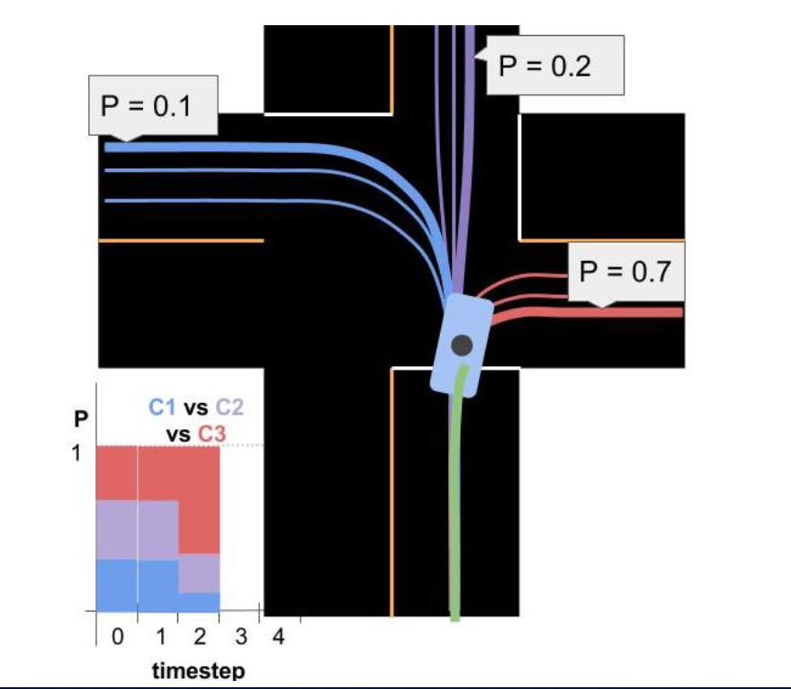
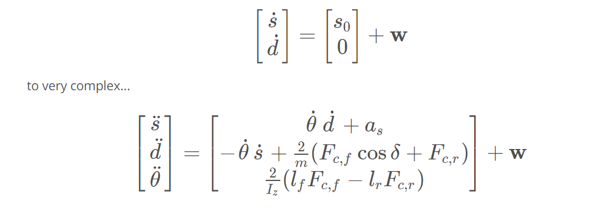
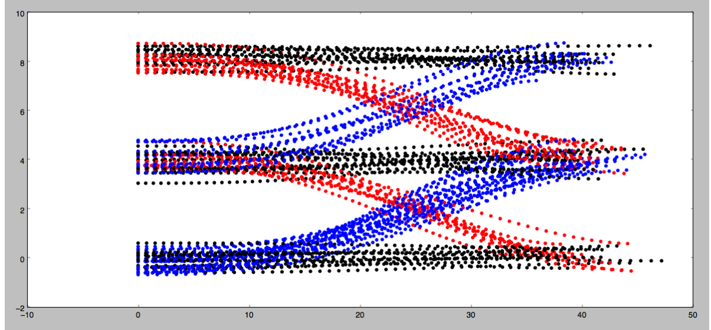
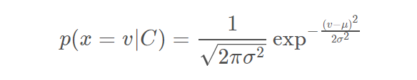
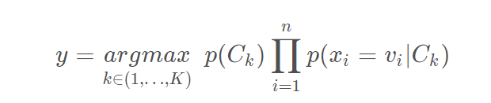

## Summary of Data Driven and Model Based Approaches

So far you have learned about the two main approaches to prediction.

## 1. Data-Driven Approaches

Data-driven approaches solve the prediction problem in two phases:

1. Offline training
2. Online Prediction

### 1.1 Offline Training

In this phase the goal is to feed some machine learning algorithm a lot of data to train it. For the trajectory clustering example this involved:

1. **Define similarity** - we first need a definition of similarity that agrees with human common-sense definition.
2. **Unsupervised clustering** - at this step some machine learning algorithm clusters the trajectories we've observed.
3. **Define Prototype Trajectories** - for each cluster identify some small number of typical "prototype" trajectories.

### 1.2 Online Prediction

Once the algorithm is trained we bring it onto the road. When we encounter a situation for which the trained algorithm is appropriate (returning to an intersection for example) we can use that algorithm to actually predict the trajectory of the vehicle. For the intersection example this meant:

1. **Observe Partial Trajectory** - As the target vehicle drives we can think of it leaving a "partial trajectory" behind it.
2. **Compare to Prototype Trajectories** - We can compare this partial trajectory to the *corresponding parts* of the prototype trajectories. When these partial trajectories are more similar (using the same notion of similarity defined earlier) their likelihoods should increase relative to the other trajectories.
3. **Generate Predictions** - For each cluster we identify the most likely prototype trajectory. We broadcast each of these trajectories along with the associated probability (see the image below).



## 2. Model Based Approaches

You can think of model based solutions to the prediction problem as also having an "offline" and online component. In that view, this approach requires:

1. *Defining* process models (offline).
2. *Using* process models to compare driver behavior to what would be expected for each model.
3. *Probabilistically classifying* driver intent by comparing the likelihoods of various behaviors with a multiple-model algorithm.
4. *Extrapolating* process models to generate trajectories.

### 2.1 Defining Process Models

You saw how process models can vary in complexity from very simple.



### 2.2 Using Process Models

Process Models are first used to compare a target vehicle's observed behavior to the behavior we would expect for each of the maneuvers we've created models for. The pictures below help explain how process models are used to calculate these likelihoods.

## Implementing Naive Bayes

In this exercise you will implement a Gaussian Naive Bayes classifier to predict the behavior of vehicles on a highway. In the image below you can see the behaviors you'll be looking for on a 3 lane highway (with lanes of 4 meter width). The dots represent the d (y axis) and s (x axis) coordinates of vehicles as they either...

1. change lanes left (shown in blue)
2. keep lane (shown in black)
3. or change lanes right (shown in red)



Your job is to write a classifier that can predict which of these three maneuvers a vehicle is engaged in given a single coordinate (sampled from the trajectories shown below).

Each coordinate contains 4 features:

- *s*
- *d*
- \\*s*˙
- \\*d*˙

You also know the **lane width** is 4 meters (this might be helpful in engineering additional features for your algorithm).

### Instructions

1. Implement the `train(data, labels)` method in the class `GNB` in `classifier.cpp`.

   Training a Gaussian Naive Bayes classifier consists of computing and storing the mean and standard deviation from the data for each label/feature pair. For example, given the label "change lanes left” and the feature \dot{s}*s*˙, it would be necessary to compute and store the mean and standard deviation of \dot{s}*s*˙ over all data points with the "change lanes left” label.

   Additionally, it will be convenient in this step to compute and store the prior probability p(C_k) for each label C_k. This can be done by keeping track of the number of times each label appears in the training data.

2. Implement the `predict(observation)` method in `classifier.cpp`.

   Given a new data point, prediction requires two steps:

   1. **Compute the conditional probabilities for each feature/label combination**. For a feature x*x*and label C*C* with mean \mu*μ* and standard deviation \sigma*σ* (computed in training), the conditional probability can be computed using the formula [here](https://en.wikipedia.org/wiki/Naive_Bayes_classifier#Gaussian_naive_Bayes):

      

      Here v*v* is the value of feature x*x* in the new data point.

   1. **Use the conditional probabilities in a Naive Bayes classifier.** This can be done using the formula [here](https://en.wikipedia.org/wiki/Naive_Bayes_classifier#Constructing_a_classifier_from_the_probability_model):

      

      In this formula, the argmax is taken over all possible labels C_k*C**k* and the product is taken over all features x_i*x**i* with values v_i*v**i*.

3. When you want to test your classifier, run `Test Run` and check out the results.

**NOTE**: You are welcome to use some existing implementation of a Gaussian Naive Bayes classifier. But to get the **best** results you will still need to put some thought into what **features** you provide the algorithm when classifying. Though you will only be given the 4 coordinates listed above, you may find that by "engineering" features you may get better performance. For example: the raw value of the d*d*coordinate may not be that useful. But `d % lane_width` might be helpful since it gives the *relative*position of a vehicle in it's lane regardless of which lane the vehicle is in.

### Helpful Resources

- [sklearn documentation on GaussianNB](http://scikit-learn.org/stable/modules/naive_bayes.html#gaussian-naive-bayes)
- [Wikipedia article on Naive Bayes / GNB](https://en.wikipedia.org/wiki/Naive_Bayes_classifier#Gaussian_naive_Bayes)

## Extra Practice

Provided in one of the links below is `python_extra_practice`, which is the same problem but written in Python that you can optionally go through for extra coding practice. The Python solution is available at the `python_solution` link. If you get stuck on the quiz see if you can convert the python solution to C++ and pass the classroom quiz with it. The last link `Nd013_Pred_Data` has all the training and testing data for this problem in case you want to run the problem offline.

## **code**

main.cpp

```c++
#include <fstream>
#include <iostream>
#include <string>
#include <vector>
#include "classifier.h"

using std::cout;
using std::endl;
using std::ifstream;
using std::string;
using std::vector;

// Helper functions to load .txt files
vector<vector<double> > Load_State(string file_name);
vector<string> Load_Label(string file_name);

int main() {
  vector< vector<double> > X_train = Load_State("./train_states.txt");
  vector< vector<double> > X_test  = Load_State("./test_states.txt");
  vector< string > Y_train = Load_Label("./train_labels.txt");
  vector< string > Y_test  = Load_Label("./test_labels.txt");
    
  cout << "X_train number of elements " << X_train.size() << endl;
  cout << "X_train element size " << X_train[0].size() << endl;
  cout << "Y_train number of elements " << Y_train.size() << endl;

  GNB gnb = GNB();
  
  gnb.train(X_train, Y_train);

  cout << "X_test number of elements " << X_test.size() << endl;
  cout << "X_test element size " << X_test[0].size() << endl;
  cout << "Y_test number of elements " << Y_test.size() << endl;
  
  int score = 0;
  for (int i = 0; i < X_test.size(); ++i) {
    vector<double> coords = X_test[i];
    string predicted = gnb.predict(coords);
    if (predicted.compare(Y_test[i]) == 0) {
      score += 1;
    }
  }

  float fraction_correct = float(score) / Y_test.size();
  cout << "You got " << (100*fraction_correct) << " correct" << endl;

  return 0;
}

// Load state from .txt file
vector<vector<double> > Load_State(string file_name) {
  ifstream in_state_(file_name.c_str(), ifstream::in);
  vector< vector<double >> state_out;
  string line;
    
  while (getline(in_state_, line)) {
    std::istringstream iss(line);
    vector<double> x_coord;
      
    string token;
    while (getline(iss,token,',')) {
      x_coord.push_back(stod(token));
    }
    state_out.push_back(x_coord);
  }

  return state_out;
}

// Load labels from .txt file
vector<string> Load_Label(string file_name) {
  ifstream in_label_(file_name.c_str(), ifstream::in);
  vector< string > label_out;
  string line;
  while (getline(in_label_, line)) {
    std::istringstream iss(line);
    string label;
    iss >> label;
    
    label_out.push_back(label);
  }
    
  return label_out; 
}
```

classifier.cpp

```C++
#include "classifier.h"
#include <math.h>
#include <string>
#include <vector>

using Eigen::ArrayXd;
using std::string;
using std::vector;

// Initializes GNB
GNB::GNB() {
  /**
   * TODO: Initialize GNB, if necessary. May depend on your implementation.
   */
  left_means = ArrayXd(4);
  left_means << 0,0,0,0;
  
  left_sds = ArrayXd(4);
  left_sds << 0,0,0,0;
    
  left_prior = 0;
    
  keep_means = ArrayXd(4);
  keep_means << 0,0,0,0;
  
  keep_sds = ArrayXd(4);
  keep_sds << 0,0,0,0;
  
  keep_prior = 0;
  
  right_means = ArrayXd(4);
  right_means << 0,0,0,0;
  
  right_sds = ArrayXd(4);
  right_sds << 0,0,0,0;
  
  right_prior = 0;
}

GNB::~GNB() {}

void GNB::train(const vector<vector<double>> &data, 
                const vector<string> &labels) {
  /**
   * Trains the classifier with N data points and labels.
   * @param data - array of N observations
   *   - Each observation is a tuple with 4 values: s, d, s_dot and d_dot.
   *   - Example : [[3.5, 0.1, 5.9, -0.02],
   *                [8.0, -0.3, 3.0, 2.2],
   *                 ...
   *                ]
   * @param labels - array of N labels
   *   - Each label is one of "left", "keep", or "right".
   *
   * TODO: Implement the training function for your classifier.
   */
  
  // For each label, compute ArrayXd of means, one for each data class 
  //   (s, d, s_dot, d_dot).
  // These will be used later to provide distributions for conditional 
  //   probabilites.
  // Means are stored in an ArrayXd of size 4.
  
  float left_size = 0;
  float keep_size = 0;
  float right_size = 0;
  
  // For each label, compute the numerators of the means for each class
  //   and the total number of data points given with that label.
  for (int i=0; i<labels.size(); ++i) {
    if (labels[i] == "left") {
      // conversion of data[i] to ArrayXd
      left_means += ArrayXd::Map(data[i].data(), data[i].size());
      left_size += 1;
    } else if (labels[i] == "keep") {
      keep_means += ArrayXd::Map(data[i].data(), data[i].size());
      keep_size += 1;
    } else if (labels[i] == "right") {
      right_means += ArrayXd::Map(data[i].data(), data[i].size());
      right_size += 1;
    }
  }

  // Compute the means. Each result is a ArrayXd of means 
  //   (4 means, one for each class)
  left_means = left_means/left_size;
  keep_means = keep_means/keep_size;
  right_means = right_means/right_size;
  
  // Begin computation of standard deviations for each class/label combination.
  ArrayXd data_point;
  
  // Compute numerators of the standard deviations.
  for (int i=0; i<labels.size(); ++i) {
    data_point = ArrayXd::Map(data[i].data(), data[i].size());
    if (labels[i] == "left"){
      left_sds += (data_point - left_means)*(data_point - left_means);
    } else if (labels[i] == "keep") {
      keep_sds += (data_point - keep_means)*(data_point - keep_means);
    } else if (labels[i] == "right") {
      right_sds += (data_point - right_means)*(data_point - right_means);
    }
  }
  
  // compute standard deviations
  left_sds = (left_sds/left_size).sqrt();
  keep_sds = (keep_sds/keep_size).sqrt();
  right_sds = (right_sds/right_size).sqrt();
    
  //Compute the probability of each label
  left_prior = left_size/labels.size();
  keep_prior = keep_size/labels.size();
  right_prior = right_size/labels.size();
}

string GNB::predict(const vector<double> &sample) {
  /**
   * Once trained, this method is called and expected to return 
   *   a predicted behavior for the given observation.
   * @param observation - a 4 tuple with s, d, s_dot, d_dot.
   *   - Example: [3.5, 0.1, 8.5, -0.2]
   * @output A label representing the best guess of the classifier. Can
   *   be one of "left", "keep" or "right".
   *
   * TODO: Complete this function to return your classifier's prediction
   */
  
  // Calculate product of conditional probabilities for each label.
  double left_p = 1.0;
  double keep_p = 1.0;
  double right_p = 1.0; 

  for (int i=0; i<4; ++i) {
    left_p *= (1.0/sqrt(2.0 * M_PI * pow(left_sds[i], 2))) 
            * exp(-0.5*pow(sample[i] - left_means[i], 2)/pow(left_sds[i], 2));
    keep_p *= (1.0/sqrt(2.0 * M_PI * pow(keep_sds[i], 2)))
            * exp(-0.5*pow(sample[i] - keep_means[i], 2)/pow(keep_sds[i], 2));
    right_p *= (1.0/sqrt(2.0 * M_PI * pow(right_sds[i], 2))) 
            * exp(-0.5*pow(sample[i] - right_means[i], 2)/pow(right_sds[i], 2));
  }

  // Multiply each by the prior
  left_p *= left_prior;
  keep_p *= keep_prior;
  right_p *= right_prior;
    
  double probs[3] = {left_p, keep_p, right_p};
  double max = left_p;
  double max_index = 0;

  for (int i=1; i<3; ++i) {
    if (probs[i] > max) {
      max = probs[i];
      max_index = i;
    }
  }
  
  return this -> possible_labels[max_index];
}
```

classifier.h

```C++
#ifndef CLASSIFIER_H
#define CLASSIFIER_H

#include <string>
#include <vector>
#include "Dense"

using Eigen::ArrayXd;
using std::string;
using std::vector;

class GNB {
 public:
  /**
   * Constructor
   */
  GNB();

  /**
   * Destructor
   */
  virtual ~GNB();

  /**
   * Train classifier
   */
  void train(const vector<vector<double>> &data, 
             const vector<string> &labels);

  /**
   * Predict with trained classifier
   */
  string predict(const vector<double> &sample);

  vector<string> possible_labels = {"left","keep","right"};
  
  ArrayXd left_means;
  ArrayXd left_sds;
  double left_prior;
  
  ArrayXd keep_means;
  ArrayXd keep_sds;
  double keep_prior;
  
  ArrayXd right_means;
  ArrayXd right_sds;
  double right_prior;

};

#endif  // CLASSIFIER_H
```

